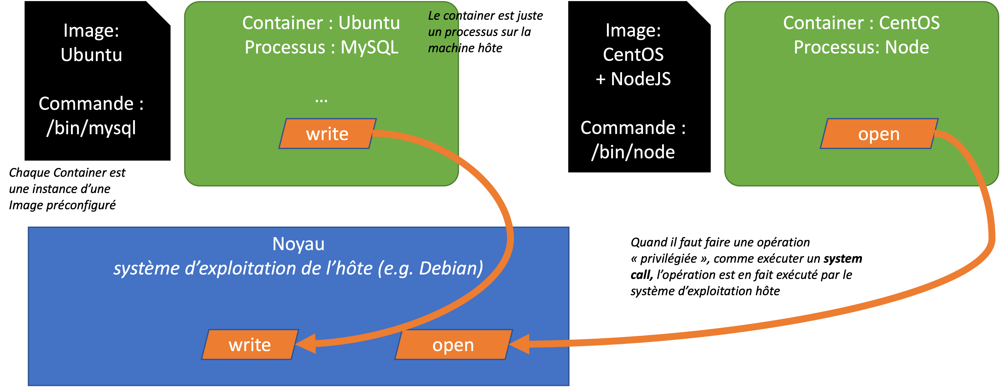
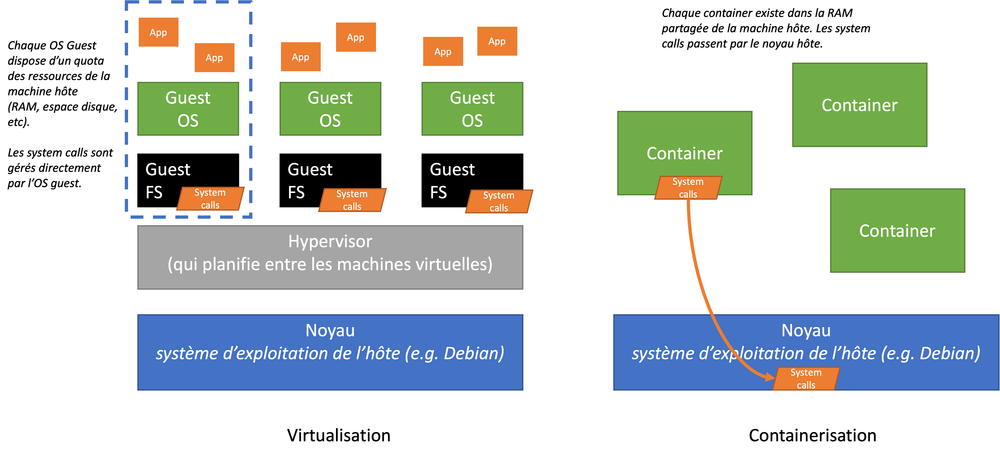

# 🐳 Docker

Tout le longue de ce cours nous avons utilisé une combinaison de Docker, VSCode et un Container Ubuntu pour experimenter avec le shell Unix.

Mais qu'est-ce que c'est Docker, et comment s'en servir ?

## Q'est-ce c'est Docker ?

Docker est un logiciel qui permet de lancer et arrêter des _Containers_ dans notre système d'exploitation.

Un _Container_ est un processus qui tourne dans un "bac à sable" (c'est à dire, isolé de tous les autres processus) sur une machine hôte.

Docker est une interface qui simplifie les principes de [namespaces et cgroups](https://medium.com/@saschagrunert/demystifying-containers-part-i-kernel-space-2c53d6979504) -- des technologies qui existent dans Linux depuis un moment pour :

* Isoler une processus
* Isoler le système de fichiers
* Isoler des réseaux (subnets)
* Contrôler finement les accès aux différents fonctionnalités dans le noyau (_kernel_)

A priori, on peut créer et lancer des Containers sans Docker, mais Docker facilite pas mal la tâche !

## Container vs Image

Un container, étant un processus unique et isolé, doit tourner quelque chose et agir sur un système de fichiers.

Nous créons des Containers à partir d'une _Image_, qui est une _snapshot_ (ou "photo") d'un système de fichiers déjà configuré pour être indépendant ou isolé.

Par exemple, je peux créer une Image d'un système d'exploitation comme Ubuntu. Dans l'image, nous aurons la hiérarchie identique à une installation Ubuntu, à partir de la racine `/`, et qui contient tous les fichiers, binaires, etc nécessaires pour tourner une distribution d'Ubuntu.

Quand on instancie une Image en Container (en gros, on crée un processus avec une Image déjà configuré) :

* Le système des fichiers est monté et disponible au processus
* Une commande dans ce système de fichiers est lancé. Cette commande n'aura accès qu'au système de fichiers de l'image.
  * Quelle commande ? A nous de préciser ! Ca pourrait être un interprète comme `bash`, ou ça peut être un autre logiciel comme `mysql` ou `node`, ou `python`.
* Le Container existera tant que le son processus existe. Dès que le processus s'arrête, le Container d'arrête aussi.

Il est important de comprendre qu'un Container est un processus comme les autres sur la machine hôte. Toutes les opérations privilégiées passe par le noyau du système d'exploitation hôte :

<figure><figcaption></figcaption></figure>

Les opérations privilégiées (ou _system calls_) sont, par exemple :

* Lire ou écrire un disque dur
* Envoyer un message sur la carte réseau
* Contrôler des processus
* ...

> Un Container, même s'il est _isolé_, n'est donc pas une machine virtuelle ! Tous les containers qui tournent sur la même machine, partagent le même noyau, le même RAM, et la même réseau.

## Docker vs une Machine Virtuelle

Une machine virtuelle est une vrai division des ressources d'un ordinateur. Quand on lance une machine virtuelle, on monte un système d'exploitation entier, qui tourne _en parallèle_ de celui du système hôte. Cette exécution et partage est géré par un _hypervisor_.

<figure><figcaption></figcaption></figure>

Pour les machines virtuelles, on affecte :

* La quantité de RAM à sa disposition
* Une espace sur le disque (au besoin)
* Le pourcentage de temps sur le CPU (ou quantité de CPUs à sa disposition).

Ces ressources, une fois allouées ne sont plus disponibles pour le système hôte, ni pour d'autres machines virtuelles.

Au contraire, avec _Containerisation_, tout est partagé.

| Virtualisation                                                                                                | Containerisation                                                                                                                                                                    |
| ------------------------------------------------------------------------------------------------------------- | ----------------------------------------------------------------------------------------------------------------------------------------------------------------------------------- |
| On peut tourner n'importe quelle système d'exploitation (Windows, Linux, MacOS) en tant que machine virtuelle | Seulement les versions de Linux compatibles peuvent tourner en Container, puisqu'ils partagent toutes le même noyau. Il faudrait que les _system calls_ soient identiques entre eux |
|  Très sécurisé : les machines sont complètement isolés entre eux et la machine hôte                           | Moins sécurisé : les containers sont isolés entre eux, mais si on a accès à la machine hôte, on peut voir dans les containers                                                       |
| Lourd en ressources : on est obligé de ceder une partie pour chaque OS                                        | Léger en ressources : on les partage, et on n'est pas obligé de tourner un OS explicitement parce qu'on utilise celui de la machine hôte                                            |

## Pourquoi la Containerisation est aussi populaire ?

Si à la base, la virtualisation est avantageux par rapport aux Containers, pour les utiliser ? Plusieurs raisons :

* Principalement la notion de combiner l'ensemble des dépendances d'un projet dans une seule unité. Par exemple, je créer une image avec Apache et PHP 5.0, et je déploie mon site sur cette base. Je peux lancer ce container sur n'importe quelle machine avec Docker, et être sur que seulement PHP 5.0 est utilisé (au lieu d'être embêté si le serveur à PHP 7.0 installé)
* Il est simple et rapide de lancer un Container, alors qu'il est parfois longue est dur de lancer et configurer une machine virtuelle
* Une Container utilise, en général, moins de ressources, donc je peux en créer plusieurs.

## Docker sur Windows

Docker sur Windows, comme vous avez constaté, est un peu sensible parce qu'à la base le noyau de Windows n'est pas compatible avec les noyaux Linux.

Pour utiliser docker sur Windows, on est donc obligé d'installer WSL (le _windows subsystem for Linux_), qui permet de lancer, en _machine virtuelle_ une instance de Linux.

Ensuite, quand on lance Docker Desktop sur windows, il va utiliser plutôt WSL pour tourner les Containers.
