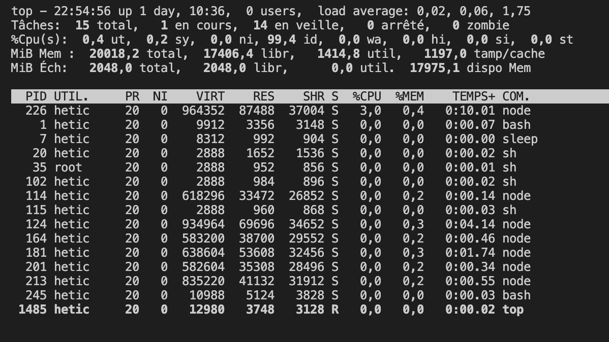

# Les processus

UNIX est un système d'exploitation multi-processus.

C'est à dire, les ressources en calcul sont partagés entre toutes les applications, logiciels, commandes, tâches de fond. Le terme collectif pour ceux-là est _processus_.

Selon le système d'exploitation, une stratégie de _planification_ (_scheduling_) est implémenté afin de donner un peu de temps à chaque processus qui est actif. Si on tourne suffisamment vite sur tous les processus, on aura l'illusion que les processus tournent en parallèle. Sur les systèmes d'exploitation modernes :

* les stratégies de planification prennent en compte la possibilité de multi-processeur, donc une vraie parallélisme est possible
* certains processus peuvent avoir plus de priorité que d'autres, notamment les processus dites _temps réel_ où il est urgent de completer la tâche. Un exemple : la lecture vidéo

## Premier et arrière plan

Sur notre machine UNIX il y a 2 sortes de processus :

* Un processus premier-plan (_foreground_)
* Un processus arrière-plan (_background_)

A chaque fois qu'on lance un nouveau shell, un nouveau processus _premier-plan_ est crée.

Quand on lance une commande, un processus _enfant_ est crée (retient un lien vers le processus qui l'a crée). On parle plutôt d'un _child process_. Ce processes est toujours en première plan, parce qu'on ne peut rien faire en attendant la complétion de la commande.

On peut bien sur, tourner un processes en arrière-plan. En ajoutant un `&` à la fin d'une commande longue, le contrôle retournera directement à l'utilisateur, et la tâche procédera à s'exécuter dans le fond.

```bash
grep -r node-main -e "include" > includes.txt &
```

Sinon, si la commande est déjà en exécution, on peut l'arrêter avec CtrlZ. Ensuite, on tape `bg` pour envoyer le processus en arrière plan.

```bash
hetic@527edcda5f70:~$ grep -r node-main -e "include" > includes.txt
^Z
[1]+  Arrêté                grep --color=auto -r node-main -e "include" > includes.txt
hetic@527edcda5f70:~$ bg
[1]+ grep --color=auto -r node-main -e "include" > includes.txt &
```

On peut remettre un processus en premier plan avec `fg [nom du processus]`.

## Moniteur des processus

Dans le shell, on peut voir un moniteur des activités sur la machine :

```bash
top
```

Qui donnera une vue comme la suivante :

<figure><figcaption></figcaption></figure>

Notez qu'on peut voir un grand nombre d'informations, y compris la RAM utilisé et disponible, le nombre de CPUs, le nombre de processus, les processus les plus gourmands, etc.

Pour quitter, appuyez sur `q`.

Une autre commande donne de l'information concernant la RAM utilisé sur le système :

```bash
free
```

Essayez !

## Liste des processus

On peut également obtenir une liste complète de processus :

```bash
# Les processus et child-process du shell ouvert
ps

# Les processus d'un utilisateur précis
ps -u[utilisateur]
ps -uhetic

# Tous les processus
ps -A

# Un processus avec un identifiant PID
ps [PID]
```

Notez que `ps` retourne, dans la première colonne, le `PID` (l'identifiant unique du processus), qui sera utile plus tard.

## Arrêter un processus

Pour terminer un processus, il suffit d'émettre :

```bash
kill [PID]
```

Parfois, on ne connais pas le \[PID] d'un processus, mais on connais son nom. Pour récupérer le \[PID] d'un processes à partir de son nom :

```bash
pidof [nom du processus]
```

Parfois il y a plusieurs processus qui partagent le même nom. On peut les arrêter tous avec la commande `killall` :

```bash
killall [nom du processus]
```
