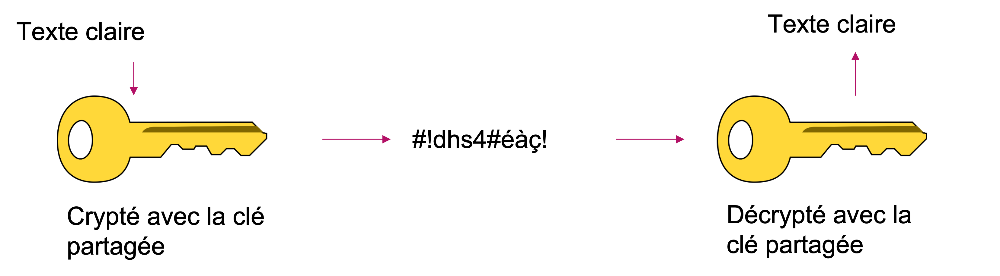
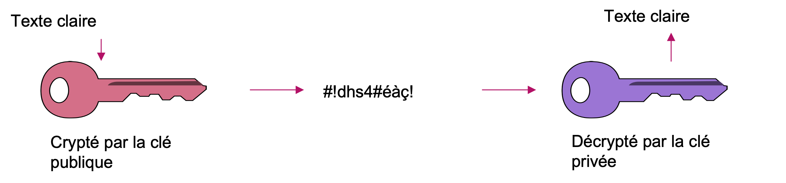
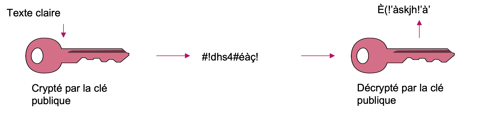
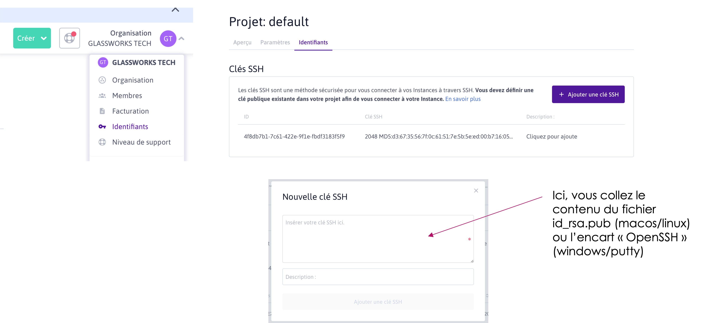

# Parenthèse : Cryptographie

La plupart des fournisseurs cloud modernes utilise la cryptographie asymétriques pour donner accès à leurs serveurs ou instances loués de leur data-centers.

La cryptographie, étant présent pratiquement partout dans nos vies aujourd’hui exige une connaissance minimale des termes et fonctionnalités.

La cryptographie à plusieurs finalités :

* Communications privées
* Identification forte
* Protection contre les attaques en force brute
* Certification
* ...

## La cryptographie _symétrique_

La cryptographie symétrique existe, selon les légendes depuis de siècles.

Est-ce que vous serez capable de décrypter et lire le message suivant ?

```
Vmjy tifmm ftu hfmjbm
```

<details>

<summary>Solution</summary>

C'est un example d'un _cipher_ par _shift_ et _substitution_. C'est à dire, on va déplacer chaque lettre de notre message par un nombre de lettres précisés par une _clé_.

Ici la clé est `1`, c'est à dire, pour crypter notre message, on se déplace sur l'alphabet par 1 caractère.

On obtient le message :&#x20;

```
Ulix shell est gelial
```

Des faut d'orthographes ? Oui ! Cela vous a mis en doute ? Probablement ! C'est perturbant pour un logiciel de hack aussi. Normalement on compare les résultats d'une tentative de décryption avec des dictionnaires des mots connus, pour savoir si on aurait trouvé la clé ou pas. Sauf, si on aura une faute d'orthographe, on serait moins certain de notre décryption !

Ce cipher est aussi connu comme le _Caesar cipher_. La légende est que Jules César l'a utiliser pour communiquer avec ses bataillons sans que l'ennemi puisse décoder ses messages.

:warning: Attention : ce cipher est extrêmement simple à cracker par un ordinateur, même si un clé autre que `1` est utilisé !

</details>

Le césar cipher est un example très très basique de la _cryptographie symétrique_. La clé est connu par l'expéditeur et le receveur du message.

<figure><figcaption></figcaption></figure>

Aujourd’hui il y a beaucoup d'algorithmes bien plus compliqués que le cipher César, et la cryptographie symétrique est bien utilisé.

* Il est _très rapide_ à encoder et décoder
* Peut être très très fort si on surmonte les problèmes de _partage_ des clés dont on parle plus tard. Par exemple, un _One Time Pad_, une clé qui ne marche qu'une seule fois, et qui serait partagé dans des conditions très sécurisés, et encore très fort. Un exemple serait une petite fiche partagé dans les activités militaires, pour par exemple, communiqué des instructions d'attaque nucléaire.

Quelques exemples des algorithmes symétriques sont :

* AES (Rijndael)
* Twofish
* Blowfish
* 3DES
* RC4
* ...

Les _désavantages_ de la cryptographie symétrique sont :

* Comment partager les clés ? Ceci est très problématique, parce que le partage initial n'est par forcément évident ni sécurisé :
  * Par exemple, si les 2 parties ne sont jamais rencontrés avant ? Par exemple, quand notre navigateur fait une première connexion à un serveur ?
* On sait qu'il n'y a qu'une seule clé, et donc il serait bien possible, avec assez de puissance de calcul en force brute (et de logique humaine !) de trouver la clé ! Il suffit d'avoir un message crypté, pour commencer une attaque en force brute.
* Une clé craqué ou volé pose certains risques :
  * Comment on peut assurer que l'expéditeur du message est bien la bonne personne ?
  * Comment on peut savoir si le message n'a pas été intercepté, modifié, puis remis sur le fil ?

> :bulb: Pendant la guerre de 39-45, les allemands on utilisés une forme de cryptographie symétrique aver leur machine _Enigma_.
>
> L'ennemi changeait régulièrement la clé, et pratiquement tous les jours les équipes de mathématiciens on du recommencer leurs efforts en décryptage.
>
> Une équipe secrete, à Bletchley Park en Angleterre a travaillé jour et nuit afin de décrypter à temps les messages interceptés des enemies. Le mathématicien Alan Turing a développé sa fameuse Turing Machine, afin d'effectuer une attaque en force brute dans l'effort de trouver la clé des messages. En, revanche, malgré sa machine, il aura fallu beaucoup d'intelligence supplémentaire afin de guider les machines et mathématiciens vers la bonne clé : la langue des messages (Allemand, Italien, ...), les personnalités impliqués (les générales, ou officiers militaires) et leurs familles, passe-temps, etc. ... puisque souvent la clé a été choisie sur un thème apprécié par les parties prenants
>
> Ensuite, une fois une clé craquée, la question est devenu, qu'en faire ? Parce que si les alliés répondait dans l'immédiat pour arrêter l'ennemie, l'ennemie aurait pu deviner que leur machine Enigma a été craquée. Le bombardement de Canterbury en Angleterre est un exemple d'un choix difficile fait par les alliés dans ce sens !

## La cryptographie _asymétrique_

Les mathématiciens ont découvert des relations algorithmiques entre des paires d'information, et le résultat est la cryptographie asymétrique, ou _Public Key Cryptography_

Au lieu d’une seule clé, on crée des _paires_ de clé :

* Une clé publique
* Une clé privée

Les 2 clés sont liées mathématiquement :

* Un message crypté avec la _clé publique_ ne peut être décrypté que par la _clé privée_ correspondante
* Un message crypté avec la _clé privée_ ne peut être décryptée que par la _clé publique_ correspondante

<figure><figcaption></figcaption></figure>

En revanche, si on essaye de crypter et décrypter un message avec _la même clé_, le résultat sera illisible :

<figure><figcaption></figcaption></figure>

Par convention, nous diffusons une de ces clés : la clé publique avec les parties avec quelle on veut communiquer. Nous gardons précieusement la clé privée.

Si je veux communique en privée avec une partie que je ne connais pas encore (par exemple, un serveur) :

* Je récupère sa clé publique (normalement disponible à télécharger)
* Je crypte un message avec sa clé publique. Seulement le serveur qui dispose de la clé privée correspondante sera capable de le décrypter.
* Pour me répondre, il pourrait faire l'inverse : il récupère ma clé publique, crypte le message avec, et je le décrypte avec ma clé privée.

Cette paire de clés nous propose beaucoup de caractéristiques intéressants :

* _Confidentialité_ : Une personne veut nous envoyer un message privé. Il crypte le message avec notre clé publique qu’il a pu récupérer facilement. Je suis la seule personne à pouvoir décrypter le message car _je suis la seule personne à disposer de la clé privée correspondante_.
* _Identité_ : Cette personne veut me rassurer que c’est bien lui qui a envoyé le message (pas d’imitation). Il « signe » le message, en le cryptant avec sa clé privée. Moi je peux récupérer sa clé publique et décrypter le message. Si le message se décrypte bien, je suis sûr de sa provenance, puisqu’il est la _seule à pouvoir crypter le message avec la clé privée correspondante_
* _Fiabilité_ : Nous pouvons nous assurer de l’intégrité d’un message (ou binaire exe, appli mobile, etc) en utilisant les clés asymétriques. Sur le App Store de Apple et Google Play, par exemple, nous « signons » nos exécutables avec notre clé développeur privé. Chaque téléphone mobile, avant d’installer l’app, va vérifier l’intégrité de l’exécutable en décryptant le binaire avec la clé publique.

Exemples des algorithmes asymétriques sont :

* RSA
  * La version initial de `RSA` est devenu trop faible aujourd’hui. Normalement on utilise RSA2 avec une clé de 256 ou 516 octets de longeur.
* Elliptic Curve Cryptographie, exemple `ed25519`
* DSS
* ...

## Exercice clés asymétriques

**Question 1**

Sur un papier brouillon (et avec des croquis) expliquez comment je (personne A) peux envoyer un message privé à une personne B, qui :

* N’est pas lisible par une partie tierce en cours de transmission
* Qui prouve que le provenance de ce message est moi-même
* Qui prouve que le message n’a pas été changé en cours de route

**Question 2**

Je veux me connecter à ma banque pour effectuer quelques transactions. Comment je peux me rassurer que le serveur auquel j’envoie des instructions s’agit bien d’un serveur de la banque, et pas une imitation crée par un hacker ? (expliquer comment les clés asymétriques son utilisées)

## Créer une paire de clés

Nous avons vus comment créer des clés avec `ssh-keygen` en utilisant notre conteneur Ubuntu dans VSCode.

La commande `ssh-keygen` est installé par défaut avec le package OpenSSH :

* _Windows_ : `ssh-keygen` est installé par défaut sur Windows 10 et 11 (suffisamment à jour), et serait disponible directement dans PowerShell. Sinon, vous pouvez :
  * Installer Ubuntu avec WSL2, et utiliser directement OpenSSH
  * Installer l'outil [PuttyGen](https://www.puttygen.com). Attention, Putty stocke les clés dans un format autre que OpenSSH. Pour l'utiliser avec SSH il faudrait exporter et sauvegarder ses clés.
* _MacOS_ : Normalement, installé par défaut avec MacOS, sinon il faudrait peut-être installé XCode pour que ce soit disponible
* _Linux_ : Normalement, installé par défaut, sinon il faut installer le package `ssh` ou `openssh` (selon votre distribution)

Normalement, on peut générer une clé avec l'algorithme RSA2 :

```
ssh-keygen -t rsa -b 2048
```

> Attention à l'emplacement de vos clés !!! Par défaut `ssh-keygen` var créer des clés sous `/home/[UTILISATER]/.ssh`, notamment la clé `id_rsa` (clé privée), et `id_rsa.pub` (la clé publique). Si vous avez déjà crée des clés, vous risquez de supprimer les anciennes. Vous ne pouvez pas revenir dessus, donc attention !!

Avec la faiblesse de RSA, on préfère d'autres algorithmes, par exemple, l'elliptique :

```
ssh-keygen -t ed25519
```

Attention, les clés générés seront stockés dans `id_ed25519` et `id_ed25519.pub` respectivement.

Pour avoir accès à un serveur distant, nous partageons notre _clé publique_ avec l'hébergeur (ou détenteur du compte auquel il donne accès), qui colle la clé publique dans `/home/[UTILISATER]/authorized_keys`.

## En savoir plus

Le sujet de cryptographie est vast et divers.

Je recommande fortement le livre _Cryptonomicon_, un roman d'espionnage de Neal Stephenson qui plonge profondément dans le sujet de cryptographie. Le livre est à la fois amusant, à la fois très informatif !

<figure><figcaption><p>Source de l'image : <a href="https://radiolab.org/episodes/139426-radiolab-reads-cryptonomicon">RadioLab</a></p></figcaption></figure>

[https://livre.fnac.com/a2592325/Neal-Stephenson-Cryptonomicon](https://livre.fnac.com/a2592325/Neal-Stephenson-Cryptonomicon)

## Exercice (Mastère seulement)

L’objectif est de simuler au maximum un déploiement réel.

Nous allons créer et configurer une instance cloud et déployer manuellement nos services dessus le longue de l'année (serveurs, SGBDR, docker, APIs, etc). Il faudrait donc savoir comment configurer une instance.

Déployez une instance chez votre fournisseur cloud préféré ([Scaleway](https://www.scaleway.com/) recommandé).

* Si pas déjà fait, créez votre compte. Rentrez vos coordonnées bancaires, et suivez les étapes pour valider votre compte (chez Scaleway, un numéro unique qui apparaît sur la ligne chez votre banque.)
* Générez votre paire de clés
* Dans votre compte, précisez votre _clé publique_ !

<figure><figcaption></figcaption></figure>

* Provisionner une instance.
  * &#x20;:warning: Attention :warning: , chez Scaleway, utilisez l'instance type _**DEV1-S**_ qui est la moins chère
* Connectez-vous à votre instance avec `ssh` :

```bash
# Scaleway (Ubuntu)
ssh root@<adresse IP>

ou

# OVH
ssh debian@<adresse IP>
#  Azure
ssh azureuser@<adresse IP>

## ATTENTION ! Si vous avez une autre paire de clés qui n'est pas à /home/[UTILISATEUR]/.ssh :
ssh -i [chemin vers la clé privée] root@<adresse IP>
```

* [Créez un compte utilisateur](../../droits/050-droits/qui.md) autre que `root`. C’est conseillé pour une meilleure sécurité ainsi que pour vous protéger contre des bêtises !

```bash
adduser <nom d’utilisateur>
```

* Si cet utilisateur aura le droit d’installer ou lancer les commandes _administratives_, [ajoutez le au groupe](../../droits/050-droits/qui.md) _sudo_

```bash
usermod -aG sudo <nom d’utilisateur>
```

* Quittez votre shell `ssh` (sous l'utilisateur `root`), et reconnectez-vous en tant que l'utilisateur dont vous venez de créer.
* Accordez accès à votre voisin (et vice versa), en utilisant sa clé publique
* Révoquer l'accès de votre voisin

> :warning: ATTENTION ! :warning:  N'oubliez pas _**d'éteindre votre instance**_ après les cours, sinon vous serait facturé pour le temps dont l'instance est active.
>
> Si vous ne comptez plus utiliser l'instance et ses ressources, vous pouvez la supprimer aussi. Vérifiez que vous avez aussi supprimé les volumes associées ainsi que les adresses IP.
>
> <mark style="color:red;">**Vous avez été prévenu !!**</mark>
