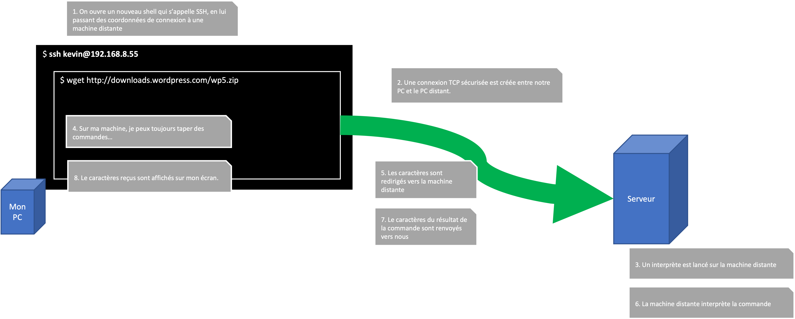

# SSH : Ouvrir un SHELL à distance

On a déjà parlé de connexion à une installation UNIX lointaine. Mais comment ouvrir cette connexion ?

[Vous vous souvenez qu'on a pu ouvrir un _shell_ dans un autre _shell_ ?](../../terminal/020-terminal/)

Nous allons utiliser le même principe maintenant, sauf que les commandes qu'on tape seront plutôt envoyés sur le réseau vers une machine lointaine, puis interprété sur cette machine là.

<figure><figcaption></figcaption></figure>

> :bulb: C'est tout l'avantage de l'invite de commandes. On peut tout contrôle avec des caractères du clavier, qui sont facilement envoyés entre les machines, sans beaucoup de charge en bande passante !

## Une connexion sécurisée

SSH utilise la technologie qui s'appelle _Public Key Cryptography_ pour sécuriser la connexion. C'est à dire, les caractères envoyés sur le réseau (ainsi que ceux reçus en réponse) sont d'abord cryptés. Un intermédiaire n'aurait pas le moyen de lire le texte transféré entre les deux machines.

Normalement il faut disposer d'un _secret_ qui est connu entre les deux machines afin de pouvoir crypter et décrypter les messages :

* un secret (ou _cipher_) symétrique : une chaîne de caractères suffisamment longue et difficile qu'on utiliser pour crypter nos messages sur le coté d'envoi, et décrypter les messages sur le coté réception. Les deux cotés connaissent le même secret.
* un secret asymétrique : on possède chacun une pair de secrets qui sont liés mathématiquement. On envoie une des deux clés à notre interlocuteur, et garde précieusement l'autre clé. Je peux crypter un message avec une des clés, et seulement la personne qui possède l'autre clé de la même paire peut décrypter le message.

La sécurité par clés asymétriques est très important dans la sécurité aujourd’hui, et est utilisé partout sur le web :

* Pour la sécurisation dans nos navigateurs (le petit cadenas dans la barre de l'URL)
* La certification des documents avec une signature électronique
* Dans la blockchain et lé crypto-monnaie

Nous revenons sur les principes des clés asymétriques plus tard dans ce cours.

## Ma première connexion SSH

Nous allons pratiquer la création d'une connexion `ssh` à un serveur que je mets à votre disposition.

D'abord, installez l'outil `ssh` :

```bash
sudo apt install ssh
```

Dans vos invites de commandes, vous allez tapez le suivant :

```bash
ssh -i ~/keys/id_rsa identifiant@unixshell.hetic.glassworks.tech
```

La première option de la commande (`-i ~/keys/id_rsa`) indique qu'il faut chercher et utiliser la clé cryptographique qui existe dans le fichier qui s'appelle `id_rsa` et qui se trouve dans le dossier `keys` de votre répertoire maison. On pourrait bien sur chercher la clé avec un chemin absolu, par exemple `-i /home/hetic/id_rsa`.

> Je vous ai déjà crée une paire de clés pour cette connexion, et configuré vos comptes sur mon serveur avec ces clés. Le dossier `~/keys` existe déjà dans [le projet VSCode que vous ai téléchargé et configuré](../../introduction/010-introduction/installation-party.md).

La deuxième option se compose d'un identifiant, suivi par l'arobase, suivi par l'URL (ou adresse IP) de la machine distante. L'identifiant est [le nom d'utilisateur dont on a parlé précédemment](../../droits/050-droits/qui.md).

> _Votre identifiant_ : Je vous ai crée chacun/chacune un compte sur mon serveur avec la commande `adduser`. Pour le nom d'utilisateur, j'ai utilisé l'adresse email que vous avez fourni chez Hetic (pout votre connexion à hyperplanning, par exemple), en remplaçant l'arobase par un point. Par exemple, mon email est :
>
> `kevin@nguni.fr`
>
> Mon identifiant est donc :
>
> `kevin.nguni.fr`
>
> Je connecte à la machine en utilisant la commande :
>
> `ssh -i ~/keys/id_rsa kevin.nguni.fr@unixshell.hetic.glassworks.tech`

Une fois connecté :

* Regardez les fichiers et la structure de la machine distante avec `ls`.
* Essayez d'apporter des modifications dans votre dossier maison, puis ailleurs dans l'arborescence
* Essayez d'installer un nouveau package avec `apt` (par exemple, le package `nodejs`).

Pour arrêter votre connexion, vous tapez la commande `exit`.

<details>

<summary>J'ai une erreur qui concerne les droits sur ma clé privée</summary>

La commande `ssh` assure des bonnes pratiques pour garder de la sécurité dans nos connexions. Un règle imposé est que la clé cryptographique doit être bien protégée. Notamment, elle ne devrait pas être lisible ni modifiable par n'importe qui (seulement son propriétaire).

Sur les systèmes UNIX, on pourrait donc modifier les droits sur la clé avec :

<pre class="language-bash"><code class="lang-bash"><strong># Assurer que la clé appartient à votre utilisateur "hetic"
</strong><strong>sudo chown hetic:hetic ~/keys/id_rsa
</strong><strong># Mettre les bonnes permissions sur la clé privée
</strong><strong>chmod 600 ~/keys/id_rsa
</strong></code></pre>

Si vous êtes sur Windows (sans invite de commandes), et vous utilise la version de `ssh` de PowerShell (vous n'êtes donc pas dans un conteneur ou machine virtuelle basé sur Unix) vous n'avez pas la commande `chmod`. Dans ce cas, il faudrait ouvrir le dialog de propriétés du fichier `id_rsa`, dans l'onglet sécurité, il faudrait retirer un maximum d'accès aux autre utilisateurs à ce fichier.

</details>

## La configuration des clés

Pour cette démonstration, j'ai crée une paire de clés au préalable :

* Une clé privée, que je vous ai partagée (`id_rsa`)
* Une clé publique, que j'ai collé dans le fichier `~/.ssh/authorized_keys`

Exercice : Etant connecté à votre compte sur mon serveur, allez chercher le fichier `~/.ssh/authorized_keys` et visionner les contenus afin de voir à quoi la clé publique ressemble.

Lorsqu'une connexion est établi par `ssh`, les caractères sont cryptés de mon coté en utilisant la clé privée. A la réception, les caractères sont décryptés en utilisant la clé publique. Seulement cette clé peut décrypter les caractères.

> Attention : ce scénario est fabriqué pour vous aider à créer votre première connexion `ssh`. Dans la vraie vie, on ne partage jamais la clé privé ! La procédure réelle est la suivant :
>
> * Je crée une paire de clés avec la commande `ssh-keygen`
> * J'envoie ma clé publique (celle qui se termine par `.pub`) à l'administrateur du serveur auquel je veux de l'accès.
> * Si l'administrateur est d'accord de me donner accès, il me crée un utilisateur (facultatif), et il copie la clé publique dans le fichier `/home/UTILISATEUR/.ssh/authorized_keys`.
>
> Je peux désormais me connecter au serveur en tant que `UTILISATEUR` avec tous les droits et groupes accordés à cet utilisateur là. Si l'administrateur du serveur veut retirer mon accès, il n'a juste à enlever ma clé publique du fichier `/home/UTILISATEUR/.ssh/authorized_keys`.

## Hacking 101

Actuellement nous utilisons tous la même paire de clés. La même clé publique est collée dans le fichier `~/.ssh/authorized_keys` de tout vos comptes.

Puisque vous possédez tous la même clé privée, vous pourriez donc _impersoner_ vos camarades. Si vous connaissez leur identifiant, vous pouvez vous connecter à leurs comptes avec la même paire de clés !

Essayez !

## Sécuriser vos comptes

On peut sécuriser nos comptes en utilisant une paire de clés différente à ce que je vous ai passé !

Quittons la connexion à la machine distante avec `exit`.

Sur notre machine locale, nous allons effectuer la commande `ssh-keygen` :

```bash
hetic@eabaf4e7983c:~$ ssh-keygen 
Generating public/private rsa key pair.
Enter file in which to save the key (/home/hetic/.ssh/id_rsa): 
Enter passphrase (empty for no passphrase): 
Enter same passphrase again: 
Your identification has been saved in /home/hetic/.ssh/id_rsa
Your public key has been saved in /home/hetic/.ssh/id_rsa.pub
The key fingerprint is:
SHA256:dkOqsde5rj1aZjlfZQNiYPjnX+Pg2gJez+Qmz5SfeRE hetic@eabaf4e7983c
The keys randomart image is:
+---[RSA 3072]----+
|        .o       |
|       .. .      |
|        . .o .   |
|         +... .E |
|      . S =    .+|
|       = + * o.*.|
|      o o @ Bo= o|
|       . *.*+O..+|
|        o++oB+ +.|
+----[SHA256]-----+
hetic@eabaf4e7983c:~$ ls ~/.ssh
id_rsa  id_rsa.pub  known_hosts
```

Ne mettez pas de mot de passe quand il vous le demande.

On voit que _sur notre machine locale_, nous avons maintenant une paire de clés dans le dossier `~/.ssh` :

* `id_rsa` : la clé privée, à protéger précieusement, et à ne jamais partager
* `id_rsa.pub` : la clé publique, qu'on partage à l'administrateur du serveur distante

Pour visionner la clé publique :&#x20;

```bash
cat ~/.ssh/id_rsa.pub
```

Vous allez ensuite reconnecter à mon serveur, et remplacer la **clé publique** dans `~/.ssh/authorized_keys` par celle qu'on vient de générer et visionner avec `cat`.

> :warning: Attention ! Si vous faites une bêtise, vous perdrez l'accès à mon serveur. La seule façon de corriger votre erreur serait de me demander de remettre en place la clé d'avant.

Quittez avec la commande `exit`.

Essayez de reconnecter avec :

```bash
ssh -i ~/keys/id_rsa identifiant@unixshell.hetic.glassworks.tech
```

<details>

<summary>Est-ce que cela fonctionne ? Pourquoi ?</summary>

La paire de clés ne correspond plus !! Ma clé privée qui se trouve à \`./id\_rsa\` ne correspond pas avec la nouvelle clé dans \`\~/.ssh/authorized\_keys\`.

Afin d'établir une connexion avec la bonne clé privée il faut plutôt utiliser :

```bash
ssh -i ~/.ssh/id_rsa identifiant@unixshell.hetic.glassworks.tech
```

</details>

L'emplacement `~/.ssh` est bien connu par la commande `ssh` comme endroit pour chercher la clé privée de l'utilisateur actuel. Donc on peut l'omettre dans la commande, et `ssh` saura où trouver la clé :

```bash
ssh identifiant@unixshell.hetic.glassworks.tech
```

> Essayez maintenant de hacker le compte de vos camarades !

## Télécharger un fichier sur le serveur

Une fois connecté à mon serveur, vous pouvez effectuer un certain nombre de commandes dans vos espaces maison. Vous pouvez créer des fichiers, les modifier, les supprimer.

Vous pouvez aussi télécharger des fichiers du web, par exemple :

```bash
wget https://dev.glassworks.tech:18081/courses/unix-shell/unix-shell-supports/-/blob/main/README.md
```

En revanche, vous n'avez pas le droit de modifier les fichiers de configuration du système (par exemple, dans `/etc`), ni exécuter certaines commandes, y compris `apt install`.

> :police\_officer: Attention à l'usage raisonnable ! Je vous ai fourni l'accès à ce serveur sous mon propre nom et compte. Vous êtes tenus à respecter l'espace qui vous êtes accordés, et ne pas télécharger des fichiers trop grands qui impacteront négativement l'experience des autres étudiants !
