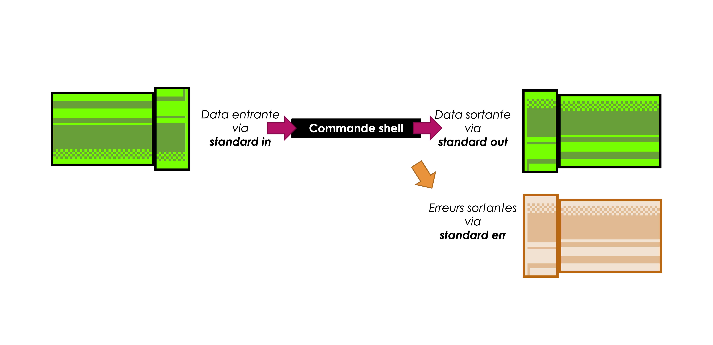

# 🌊 Pipes et redirections

Les commandes UNIX bénéficient d'un système de _communication inter-processus_.

C'est à dire, une commande peut envoyer des résultats sur un _flux_, et ce flux peut -être lu, traité, transformé ou interprété par une commande suivante. On pourrait ainsi créer des enchaînements de commandes.

<figure><figcaption></figcaption></figure>

Il existe trois flux adressables :

* _standard in_ : un flux entrant
* _standard out_ : un flux sortant (avec les résultats)
* _standard err_ : un flux sortant (avec des erreurs)

Les données sortantes (`stdout`) d’une commande peuvent être redirigées dans le `stdin` d’une commande suivante :

```bash
cat test.txt | grep "hello" | wc -l
```

<figure><figcaption></figcaption></figure>

> On utilise le symbole `|` pour représenter les tuyaux entre les différentes commandes.

Et les deux extrémités de mon flux ?

* Coté entrant, on pourrait lire des données du flux _standard in_. Selon la commande, on va lire automatiquement du _standard in_, ou bien préciser de lire de ce flux (au lieu d'un fichier) avec une option
* Coté sortant, on affiche le texte résultant de notre enchaînement sur le _standard out_, qui dans notre cas est dans l'invite de commandes.

<figure><figcaption></figcaption></figure>

Qu’est-ce qui se passe si je tape `grep "hello"` tout seul sur l’invite de commande ? Essayez !

* Vous arrivez à expliquer ce qui se passe ?
