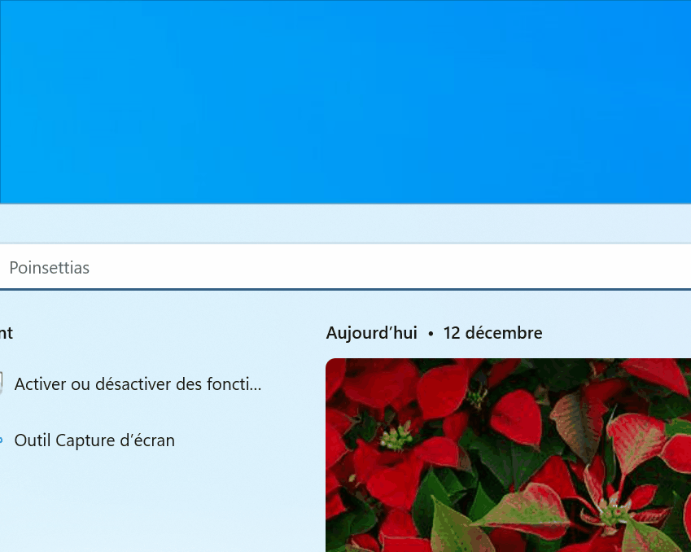
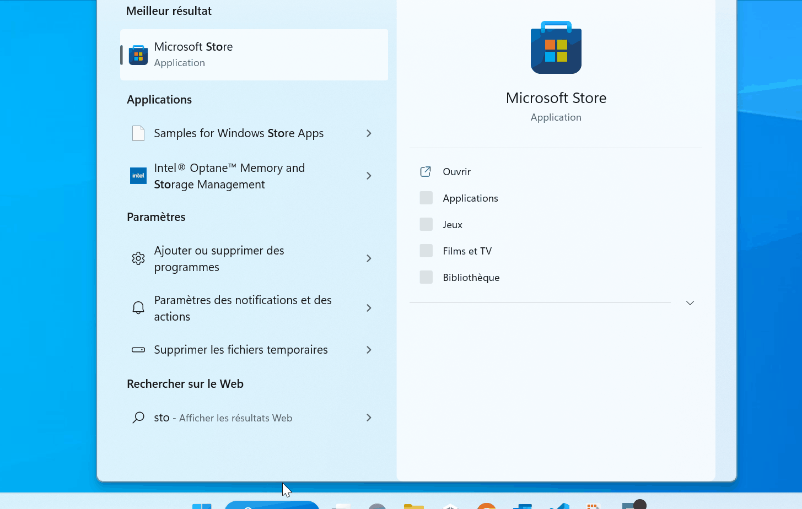
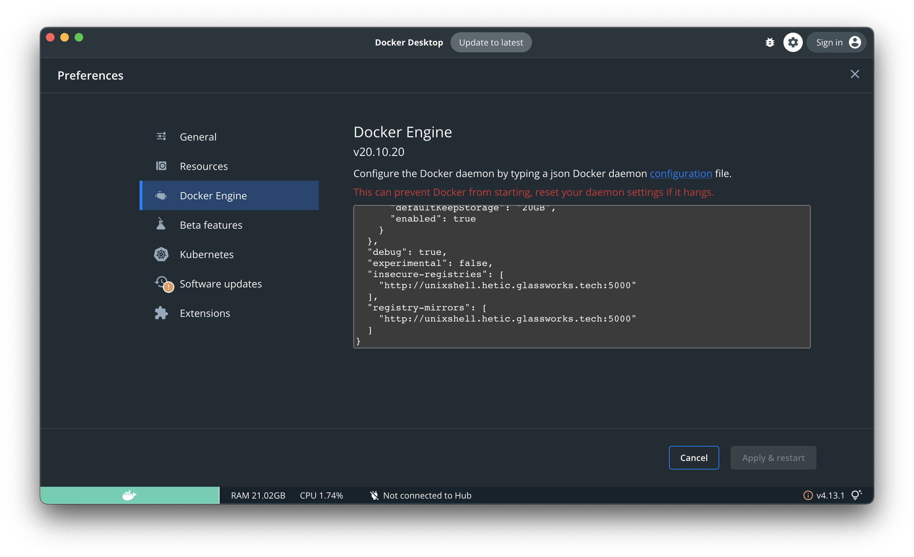
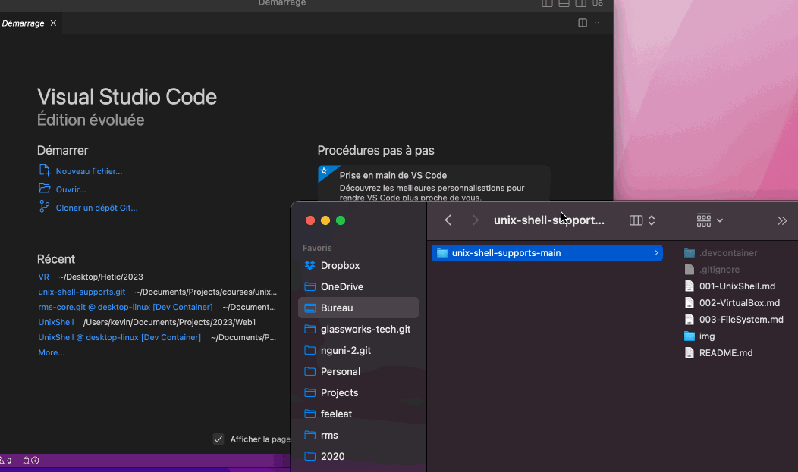
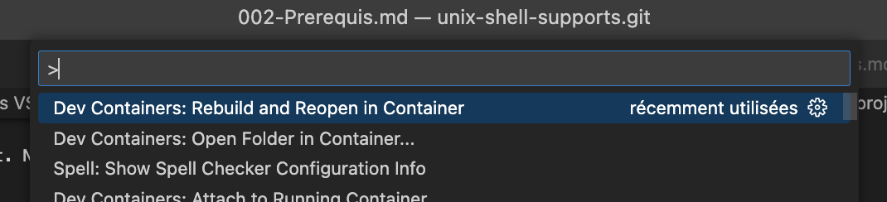
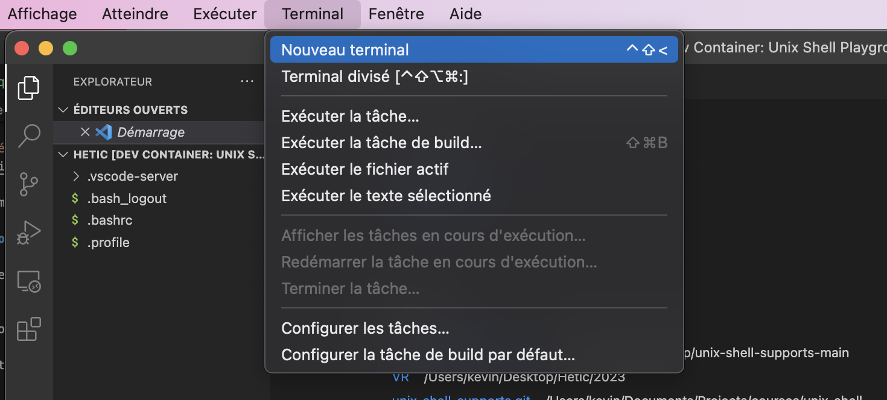
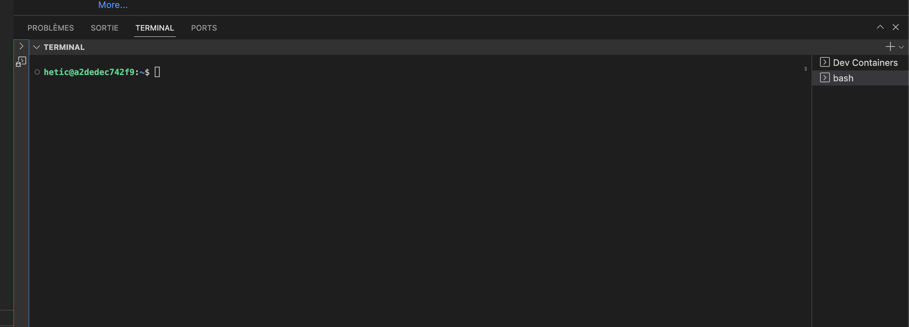

# 🎉 Installation Party

Il est conseillé de suivre et répéter les commandes que je vous présente pendant ce cours.

Pour cela, il faudrait accès à un système basé sur Unix. Il y a plusieurs options selon votre système d'exploitation.

Nous allons ouvrir un conteneur **Ubuntu 20.04** en utilisant **Docker**. Il faudrait suivre les instructions suivantes pour installer les composants nécessaires.

<details>

<summary>1 - (Windows 10 et 11 seulement) Installer WSL</summary>

Le WSL (_**W**indows **S**ubsystem for **L**inux_) est une extension à Windows qui permet de tourner le système d'exploitation Linux sur Windows.

Il est essentiel pour faire tourner Docker Desktop (à installer plus tard) sur Windows.

1. Vérifiez que vous avez au moins Windows 10, version 2004 (build 19041). Vous trouverez cette information dans `Paramètres / Système / Information système`. Si vous avez une version antérieure, il faut mettre à jour votre système d'exploitation dans `Mise à Jour et Sécurité`
2.  Activez WSL dans les réglages de votre système

    1. Dans la barre de recherche, tapez "Activer ou décativer des fonctionnalités Windows"... cliquez sur l'option du panneau de configuration
    2. Cherchez et activez "Sous-système Windows pour Linux"
    3. Cherchez et activez "Plateforme de machine virtuelle"

    <figure><figcaption></figcaption></figure>
3. (Facultatif) Sur certaines machines, il faut installer la mise à jour du noyau WSL. [Téléchargez et installer la mise à jour ici](https://wslstorestorage.blob.core.windows.net/wslblob/wsl\_update\_x64.msi)
4. Ouvrez le Microsoft Store, et cherchez `Ubuntu`. Cliquez sur `Installer`. Une fois terminé, cliquez sur `Ouvrir`. On vous demandera un nom d'utilisateur et mot de passe pour votre installation Linux. Précisez et notez bien vos choix.



Si vous rencontrez des erreurs lors de l'installation de WSL, suivez bien les instructions et/ou les liens qui vous sont indiqués pour résoudre le problème !

Il est possible qu'il faut activer la _virtualisation_ dans vos réglages BIOS. Pour cela, vous redémarrez votre ordinateur, et au moment du lancement de l'ordinateur (avant de voir le chargement de Windows), appuyez sur F2, F8 ou F10 (selon votre marque de machine) pour rentrer dans les réglages BIOS. Chercher l'option type "Activez la virtualization".

</details>

<details>

<summary>2 - Installer et configurer Docker Desktop</summary>

Docker Desktop est l'application qui tourne le service Docker sur nos PCs et Mac. C'est une application nativement conçu pour Linux, mais grâce à leur versions "**Desktop**" on pourrait l'installer en local.

Attention \

Vous pouvez le télécharger ici :

[Installer Docker Desktop](https://www.docker.com/products/docker-desktop/)

Lancez l'installeur, et suivez les instructions.

A noter ! Si vous ête sur MacOS, il faut bien télécharger la bonne version de Docker Desktop pour votre architecture. Si vous avez un M1 ou M2, il faut choisir la version pour "Apple", sinon, la version "Intel".

Un fois que Docker Desktop est ouverte, on va lui dir d'utiliser un dépôt d'images local (qui contourne les quotas mis sur l'école). Ouvrez Docker Desktop, et cliquez sur le petit engrenage pour voir les réglages. Vous allez dans _Docker Engine_, puis vous ajoutez la configuration suivante :

```json
  "insecure-registries": [
    "http://unixshell.hetic.glassworks.tech:5000"
  ],
  "registry-mirrors": [
    "http://unixshell.hetic.glassworks.tech:5000"
  ]
```

Ce morceau de json devrait être intégré dans le json comme indiqué dans l'image dessous. Attention à ajouter une virgule avant l'élément précédent !



Par exemple, votre fichier ressemblera au suivant :

```json
{
  "builder": {
    "gc": {
      "defaultKeepStorage": "20GB",
      "enabled": true
    }
  },
  "debug": false,
  "experimental": false,
  "insecure-registries": [
    "http://unixshell.hetic.glassworks.tech:5000"
  ],
  "registry-mirrors": [
    "http://unixshell.hetic.glassworks.tech:5000"
  ]
}
```


</details>

<details>

<summary>3 - Installer Visual Studio Code</summary>

Visual Studio Code est un éditeur de code léger et puissant. Notamment, cet éditeur nous permet d'ouvrir un conteneur Linux, et taper les commandes dans un shell.

[Télécharger VSCode](https://code.visualstudio.com/download)

</details>

<details>

<summary>4 - Télécharger le Projet VSCode</summary>

Une configuration VS code a été crée et est disponible dans un dépôt GIT publique.

[Télécharger la configuration VSCode](https://dev.glassworks.tech:18081/courses/unix-shell/unix-shell-supports/-/archive/main/unix-shell-supports-main.zip)

Décompressez l'archive à un endroit connu sur votre ordinateur.

</details>

<details>

<summary>5 - Créer un Conteneur Ubuntu dans VSCode</summary>

Si pas déjà le cas, ouvrez l'application `Docker Desktop`. On sait qu'il Docker Desktop s'est bien lancé quand son icône arrête de clignoter parmi les tâches de fond de votre ordinateur : 

Lancez VSCode.

Dans la fenêtre initiale, vous glissez le dossier contenant la configuration VS dans la fenêtre. Ou sinon, vous parcourez le dossier.

A noter: il faut choisir le dossier qui contient le sous-dossier `.devcontainer` :

```
unix-shell-supports <--- Le dossier à glisser (ou sélectionner) dans VSCode
  |- README.md
  |- .devcontainer
  |- ...
```



Si VSCode pose la question de se fier aux source, cliquez sur `Oui`.

Si vous verrez une petite fenêtre en bas à droite demandant d'installer l'extension `Dev Containers`, cliquez sur `Oui`.

Vous verrez en bas à droite une petite fenêtre demandant d'ouvrir dans un **Container.** Cliquer sur **"Reopen in Container"**. Si vous ne voyez pas cette petite fenêtre, appuyer sur `F1`, puis taper "Reopen..." :



Cliquez sur "Dev Containers: Rebuild and Reopen in Container".

La fenêtre VSCode se relance, et en bas à droite on vois "Starting Dev Container (show log)".

Attendez la configuration automatique de votre container Linux Ubuntu !

_\*\*\*\*_:warning: _\*\*\*\*_ :warning: _**Attention, une connexion Internet est obligatoire pour ce dernier étape. S'il y a une erreur pendant la configuration, fermez VSCode et recommencez.**_ :warning:_\*\*\*\*_:warning:_\*\*\*\*_

</details>

<details>

<summary>6 - Ouvrir un Shell Ubuntu dans VSCode</summary>

Une fois l'étape précédents terminé, on clique sur le menu `Terminal / Nouveau Terminal` dans VSCode :



En bas de la fenêtre VSCode, un nouveau terminal s'ouvre avec le shell Bash :



:tada: Felicitations ! Vous avez maintenant accès à un Shell Unix !

</details>
