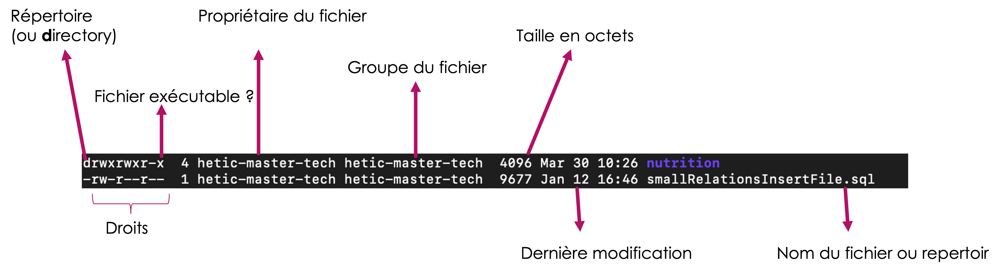

# Mes premières commandes

Il est temps d'utiliser le shell pour effectuer des tâches sur la machine auquel on est connecté. Par exemple :

* Ecrire un message dans le terminal
* Lister les fichiers dans le dossier actuel
* Changer de repertoire
* Savoir dans quel repertoire on se trouve
* ...

## Ecrire un message

La commande `echo` sert à écrire un message dans le terminal (notamment sur le flux qui s'appelle `standard out` ... on apprendra plus sur ce flux plus tard).

```bash
echo "Hello world"
```

## Lister les fichiers dans le dossier actuel

La command `ls` sert à **l**i**s**ter les dossiers et fichiers dans le repertoire actuel.

```bash
ls
```

Qu'est-ce que vous voyez ? Est-il utile pour vous ?

On pourrait préciser des options pour la commande `ls`, en ajoutant un paramètre :

```bash
ls -l
```

Par exemple :

```bash
hetic@8483b3790221:~$ ls -l
total 24
-rw-r--r--  1 hetic hetic 2299 nov.  23 20:50 001-UnixShell.md
-rw-r--r--  1 hetic hetic 4383 déc.  13 09:29 002-Prerequis.md
-rw-r--r--  1 hetic hetic 1475 nov.  23 20:50 003-FileSystem.md
drwxr-xr-x  8 hetic hetic  256 déc.  13 09:29 img
drwxr-xr-x  3 hetic hetic   96 déc.  12 15:55 introduction
drwxrwxr-x 40 hetic hetic 1280 déc.  13 09:52 node-main
-rw-r--r--  1 hetic hetic  145 déc.  12 15:55 README.md
-rw-r--r--  1 hetic hetic  587 déc.  12 15:55 SUMMARY.md
drwxr-xr-x  3 hetic hetic   96 déc.  12 15:55 terminal
```

Cela veut dire quoi exactement ?

<figure><figcaption><p>Explication d'un listing longue</p></figcaption></figure>

## Trouver de l'aide sur une certaine commande

Pour la plupart des commandes, il est possible de connaître les options et paramètres possibles, avec le suffixe `--help` :

```bash
ls --help
```

Exemple:

```bash
hetic@8483b3790221:~$ ls --help
Utilisation : ls [OPTION]... [FICHIER]...
Afficher des renseignements sur les FICHIERs (du répertoire actuel par défaut).
Trier les entrées alphabétiquement si aucune des options -cftuvSUX ou --sort
ne sont utilisées.

Les arguments obligatoires pour les options longues le sont aussi pour les
options courtes.
  -a, --all                  ne pas ignorer les entrées débutant par .
  -A, --almost-all           ne pas inclure . ou .. dans la liste
      --author               avec -l, afficher l'auteur de chaque fichier
  -b, --escape               afficher les caractères non graphiques avec des
                               protections selon le style C
      --block-size=TAILLE    avec -l, dimensionner les tailles selon TAILLE avant
                               de les afficher. Par exemple, « --block-size=M ».
                               Consultez le format de TAILLE ci-dessous
  -B, --ignore-backups       ne pas inclure les entrées se terminant par ~ dans
                               la liste
  ...
```

Une autre option est d'utiliser la documentation, ou _manual_ :

```bash
man ls
```

Un lecteur de pages manuel s'ouvre avec de la documentation concernant la commande demandée. Pour naviguer dans ce document :

* Entrée : déscend dans la page
* Q : quitter
* / : lancer une recherche. Tapez `/` puis continuer avec le terme recherche. Appuyez sur entrée pour lancer la recherche.
