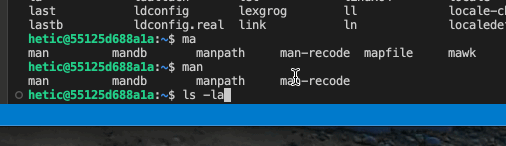
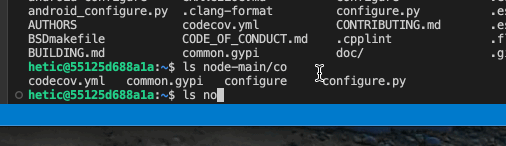

# Quelques raccourcis grâce à `bash`

L'interprète `bash` nous fournit quelques raccourcis qui permet une utilisation plus simple de l'invite de commandes.

1. Historique : une historique de toutes nos commandes précédentes est maintenu. On peut parcourir ces commandes avec les boutons <kbd>↑</kbd> et <kbd>↓</kbd>.

<figure><figcaption></figcaption></figure>

2. Auto-complète : quand on est en train de taper une commande ou un chemin, on pourrait utiliser le bouton <kbd>Tab</kbd> pour compléter automatiquement le mot en cours.

<figure><figcaption></figcaption></figure>

## Exercice

Lancer l'interprète `sh` :

```bash
sh
```

Commencez par exécuter quelques commandes comme `echo` et `ls`.

Ensuite, essayez d'utiliser les touches <kbd>↑</kbd> et <kbd>↓</kbd>, ou bien  <kbd>Tab</kbd>. Est-ce qu cela fonctionne toujours ?

Quittez `sh` avec la commande suivante :

```
exit
```