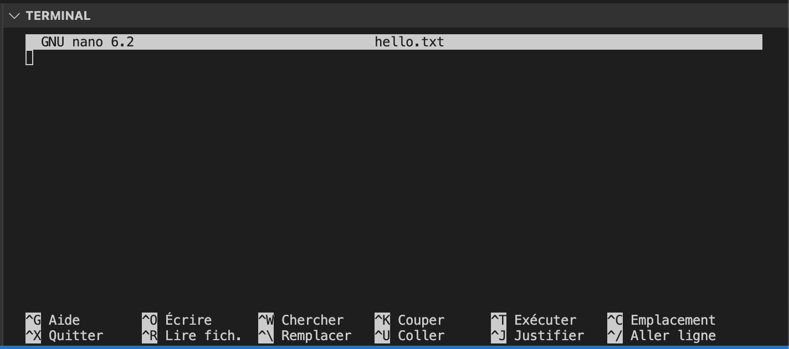

# Edition des fichiers

On est souvent amené à modifier des fichiers dans Unix.

En effet, quand on maintient un serveur à distance via l'invite de commandes, notre seule façon de changer un paramètre ou configuration est de modifier un fichier du type texte qui contient ses paramètres.

Il existe plusieurs éditeurs de texte qui s'ouvrent directement dans l'invite de commandes. Ses éditeurs prennent le contrôle entier de notre invite de commandes pour qu'on puissent visionner et modifier le contenu d'un fichier.

## `nano` (ou `pico`)

`nano` est un éditeur de text simple est intuitif, qui est aussi installé sur la plupart des distributions Unix et Linux.

En revanche, il n'est pas installé dans notre configuration VSCode. Pour l'installer :

```bash
# Installer nano (à faire une fois)
sudo apt install nano
```

Dans le code ci-dessus, on exécute une instruction privilégié, donc on précise d'abord de le faire en tant que _super user_ (donc `sudo`). `apt` est le gestionnaire de packages pour la distribution Ubuntu. On dit à `apt` d'installer le package qui s'appelle `nano`.

Pour commencer l'édition d'un fichier :

```bash
nano hello.txt
```

<figure><figcaption><p>L'éditeur nano</p></figcaption></figure>

On peut commencer à taper notre texte.

Voici la liste de commandes possibles pour la manipulation du fichier :

| Geste clavier | Explication                                                     |
| ------------- | --------------------------------------------------------------- |
| Ctrl S        | sauvegarder le fichier en cours                                 |
| Ctrl O        | sauvegarder sous … (permet de changer le nom du fichier)        |
| Ctrl X        | quitter                                                         |
| Maj →         | sélectionner des caractères                                     |
| Ctrl K        | couper (une sélection, ou la ligne s’il n’y a pas de sélection) |
| Alt 6         | copier                                                          |
| Ctrl U        | coller                                                          |
| Ctrl W        | rechercher                                                      |
| Alt W         | continuer la recherche                                          |

[Vous trouverez plus de commandes ici](https://www.nano-editor.org/dist/latest/cheatsheet.html)

Donc après avoir rédiger un peu de texte, appuyer sur Ctrl S pour sauvegarder, puis Ctrl X pour quitter.

Vérifiez que votre fichier a été crée :

```bash
hetic@55125d688a1a:/tmp$ ls -l
total 44
-rw-r--r-- 1 hetic hetic    17 déc.  13 14:56 hello.txt
```

Vérifier les contenus de votre fichier :

```bash
hetic@55125d688a1a:/tmp$ cat hello.txt 
This is a test.
```

## `vi` ou `vim`

`vi` est un autre éditeur très puissant, mais qui a une courbe d'apprentissage assez élevée. Il y a, en effet, beaucoup de raccourcis clavier à apprendre, mais une fois appris, on peut aller très vite, et effectuer des opérations complexes.

Souvent, si `nano` n'est pas installé sur un système Unix, vous trouverez `vi` à sa place. Il est donc important de pouvoir au moins créer et éditer des fichiers avec `vi` dans le cas où vous n'avez pas suffisamment de permissions pour installer des nouveaux packages.

Pour installer vi dans notre configuration VSCode :

```bash
sudo apt install vim
```

Ouvrez votre fichier texte dans `vi` :

```bash
vi hello.txt
```

<figure><figcaption><p>L'éditeur vi</p></figcaption></figure>

Dans vi, nous trouvons deux modes de fonctionnement

* _Command mode_ : La touche « Echapper » fait activer le mode « command »
* _Insertion mode_ : La touche « i » fait activer le mode « insertion » pour la rédaction du text

Quand on lance `vi` on est par défaut dans le mode « command ». On ne peut pas juste commencer à taper du texte. Les touches auront un autre sens que le texte pûr, et plutôt chaque touche va effectuer une opération à notre texte selon la position du curseur.

Pour commencer à taper du texte, appuyez sur la touche i. Vous remarquerez en bas à gauche le texte `-- INSERTION --` qui indique qu'on est en mode insertion. Vous pouvez désormais taper votre texte.

Une fois terminé, il faut qu'on repasse on mode « commande » pour sauvegarder et quitter l'éditeur.

* Appuyez sur Esc pour quitter le mode _insertion_
* Appuyez sur : puis w puis Entrée afin de sauvegarder le fichier (w pour _write_)
* Appuyez sur : puis q puis Entrée afin de quitter `vi`

Si vous voulez quitter sans sauvegarder appuyez sur :q!Entrée

Voici quelques commandes utiles en mode _commande_ :

| Geste clavier                         | Explication                                             |
| ------------------------------------- | ------------------------------------------------------- |
| :w                                    | sauvegarder                                             |
| :wq                                   | enregistrer et quitter                                  |
| :q                                    | quitter                                                 |
| :q!                                   | quitter sans enregistrer                                |
| :234                                  | aller à la ligne 234                                    |
| yy                                    | copier (yank) la ligne en cours                         |
| 3yy                                   | copier 3 lignes                                         |
| yw                                    | copier jusqu’au début du prochain mot                   |
| yiw                                   | copier le mot actuel                                    |
| p                                     | coller                                                  |
| dd                                    | couper (delete) la ligne en cours                       |
| x                                     | suppression du caractère sous le curseur                |
| :/terme-de-recherche                  | recherche (puis n pour le mot prochain)                 |
| :%s/terme-de-recherche/remplacement/g | chercher le mot et le remplacer partout dans le fichier |

## D'autres éditeurs

Il existe d'autres éditeurs, comme `emacs` ou autre. C'est à vous de les tester et décider votre préférence !

<figure><figcaption><p>La guerre des éditeurs</p></figcaption></figure>

[La guerre des éditeurs](https://www.youtube.com/watch?v=3r1z5NDXU3s)
