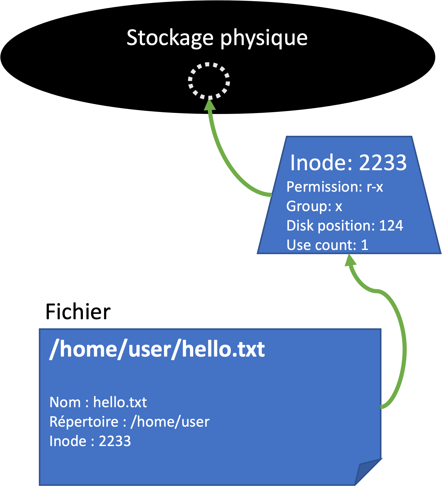
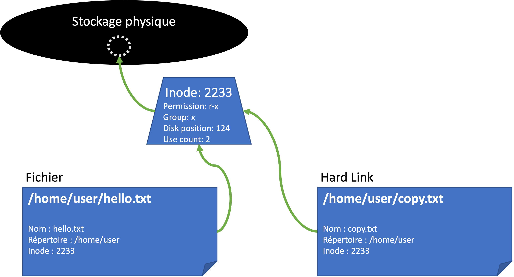
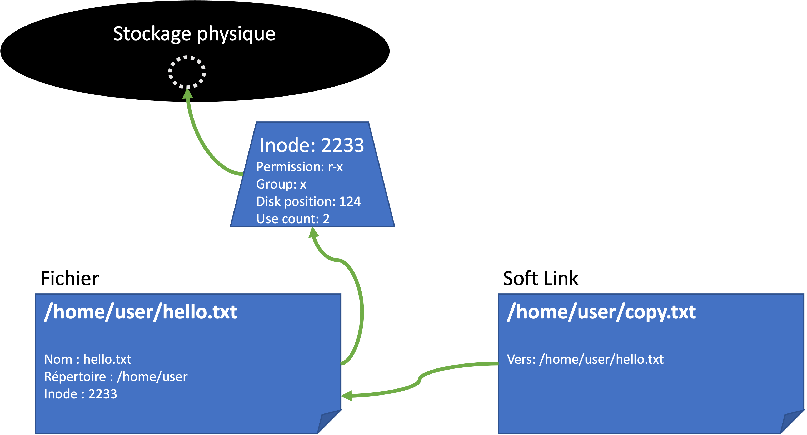

# Fichiers spéciaux

Dans UNIX tout est basé sur les fichiers, mais tous les fichiers ne sont pas pareils.

## Fichiers cachés

Nous avons déjà vus des fichiers cachés, qui commence par un point (`.`), par exemple le fichier `.bashrc`

Comment rendre un fichier caché ?

Il suffit de le nommer avec un point comme premier caractère :

```bash
touch .cachecache
```

Refaites un `ls` et vous ne verrez pas le fichier. Faites un `ls -a` et vous verrez votre fichier !

Si vous avez déjà un fichier, et vous voulez le cacher, il suffit de le renommer :

```bash
touch monfichier.txt
mv monfichier.txt .monfichier.txt
```

> :warning: Attention :warning: Rendre un fichier caché ne le protège pas contre l'accès non-autorisé. Si quelqu'un trouve le fichier caché il pourrait toujours l'ouvrir ou modifier. Nous allons traiter la question d'accès plus tard.

## Liens

Un lien dans UNIX est comme un raccourci sur Windows, mais bien plus puissant et utile.

Un _lien_ se comporte comme un fichier, mais est juste une sorte de raccourci vers un autre fichier qui se trouve ailleurs dans l'arborescence globale. On peut lire ou modifier le lien comme s'il était le vrai ficher.

Pourquoi crée des liens ?

* Parfois on aimerait référencer le même fichier à plusieurs endroits dans l'arborescence. Par exemple, le même fichier de configuration qui est partagé entre plusieurs services. Au lieu de copier plusieurs fois le fichier, j'en crée un seul, puis je crée plusieurs liens qui pointent vers le fichier d'origine. Toute modification du fichier sera pris en compte par tous les services qui l'utilisent.

Il y a deux sortes de liens dans UNIX:

1. _Hard links_ : 2 _fichiers_ pointent vers le même `inode`
2. _Soft links_ : Un lien qui pointe vers un autre _fichier_

Fichier ? inode ? lien ? Quelle différence ?

* `inode` : Vous avez peut-être remarqué que Unix utilise un autre format de stockage que Windows (`ext3` par exemple). Dans ce système les données sur le disque sont représentés par des structures qui s'appellent `inodes`. Cette structure contient des informations comme l'emplacement sur le périphérique physique, les droits sur le fichier, etc.
* `fichier`: Un fichier donc fait le lien entre un `inode` et l'emplacement dans l'arborescence logique.
* `soft link`: Un lien vers un autre fichier, qui lui même pointe vers un `inode`.

<figure><figcaption></figcaption></figure>

L'avantage de cette structure est que je peux déplacer un fichier dans l'arborescence (par exemple, mettre le fichier `hello.txt` dans un autre répertoire), et ça ne ferait juste une modification dans le fichier. Le `inode` ne bouge pas et aucune données ne sont copiés ni déplacées.

### Hard links

Un _hard link_  est en effet un deuxième fichier qui pointe vers le même `inode`.

<figure><figcaption><p>Hard Link</p></figcaption></figure>

Si je modifie soit `hello.txt` soit `copy.txt`, la modification sera visible dans les deux fichiers.

Si je supprime `hello.txt`, le `inode` continue d'exister. C'est seulement au moment où je supprimer `copy.txt` que le `inode` est supprimé et la place sur le stockage est libérée.

Essayons :

Créez un nouveau fichier :

```bash
touch hello.txt
```

Ouvrez l'éditeur de votre choix et rédiger un peu de texte.

Ensuite créez un lien avec la commande `ln` :

```bash
# Syntaxe : ln [fichier d'origine] [nom du lien]
ln hello.txt copy.txt
```

Si vous faites un `ls -l`, vous verrez vos 2 fichiers.

Apportez une modification à `copy.txt`. Ouvrez `hello.txt`, vous verrez votre modification !

Supprimez `hello.txt`:

```bash
rm hello.txt
```

Faites un `ls -l`, vous verrez toujours `copy.txt` parce que le `inode` existe toujours.

Supprimez `copy.txt`. Maintenant le `inode` est supprimé aussi.

### Soft links

Un _soft link_ pointe plutôt vers un autre fichier.

<figure><figcaption><p>Soft Link</p></figcaption></figure>

La différence est que le _soft link_ ne connaît rien du `inode`. Il dépend entièrement du fichier d'origine. Il agit comme le fichier même (on peut l'ouvrir, modifier, etc), mais si on supprime le fichier d'origine, le lien devient non-valable.

Essayons. Créez de nouveau votre fichier `hello.txt`

```bash
touch hello.txt
```

Ensuite, nous créons un _soft link_ vers ce fichier :

```bash
# Syntaxe : ln -s [fichier d'origine] [nom du lien]
ln -s hello.txt copy.txt
```

La différence est qu'on voit la cible de notre lien avec `ls -l` :

```bash
total 0
lrwxrwxrwx 1 hetic hetic 9 déc.  15 14:00 copy.txt -> hello.txt
-rw-r--r-- 1 hetic hetic 0 déc.  15 13:59 hello.txt
```

Supprimez `hello.txt` :

```bash
rm hello.txt
```

Si vous faites `ls -l` vous verrez que le lien est indiqué en rouge, il n'est plus valable. Si vous essayez lister les contenus de `copy.txt` il y a une erreur :

```bash
hetic@55125d688a1a:/tmp/test$ cat copy.txt 
cat: copy.txt: Aucun fichier ou dossier de ce type
```

### Hard vs Soft ?

On utilise plus souvent les « soft links » pour une configuration. Imaginons le scenario suivant :

* Un logiciel attend un fichier de configuration dans `/etc/world/world.conf`
* On crée un lien vers la configuration :
  * `world.conf -> world.v1.conf`
* Demain, je veux essayer une nouvelle configuration. J’enlève l’ancien lien à `world.v1.conf` (sans supprimer ce dernier), et je crée un nouveau vers la v2 :
  * `world.conf -> world.v2.conf`

Mon serveur Apache va servir tous les sites-web qui se trouvent dans `/var/www` Sauf, il n’y a pas assez de place sur le volume principal. On va plutôt stocker les données des sites sur un autre volume monté sur `/mnt/data/www` Pour ajouter un site à Apache, il suffit d’aller dans `/var/www`, puis créer une lien vers un dossier dans `/mnt/data/www` Exemple:

```bash
/var/www$ ln –s /mnt/data/www/surfsup.com  surfsup.com
```

> :open\_file\_folder: A noter, un lien (_hard_ ou _soft_) peut aussi pointer vers un repertoire !&#x20;
