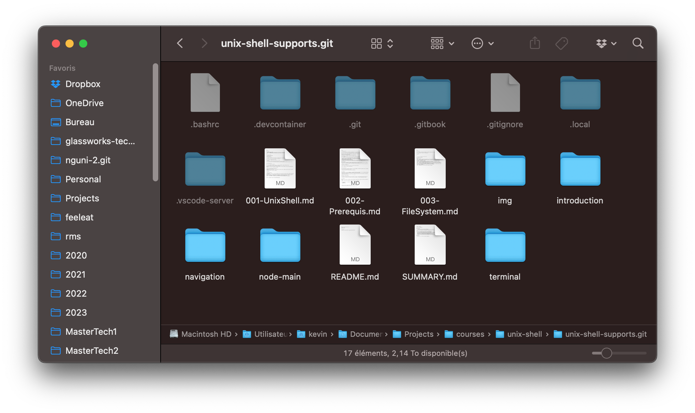
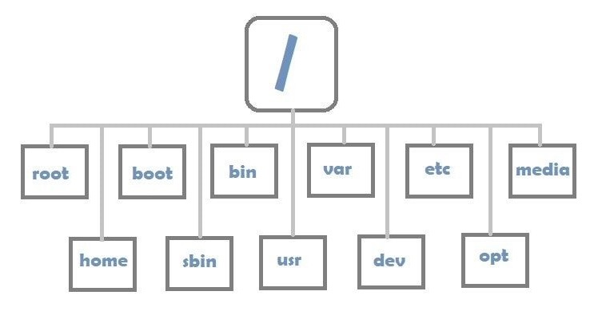

# Navigation

Nous sommes habitués à une representation visuelle de la structure de nos fichiers et repertoires (ou son équivalent **dossier**):

<figure><figcaption></figcaption></figure>

Dans une invite de commandes, on n'a pas cette representation visuelle. Comment naviguer entre les dossiers ?

## Savoir où on est ?

A tout moment dans le SHELL, notre curseur se trouve dans un répertoire précis.

Quand on lance l'invite de commandes pour la première fois, par défaut, ce répertoire est le repertoire dit _home_ ou _maison_ de l'utilisateur, qui est souvent au chemin suivant :

```bash
/home/[nom d'utilisateur]
```

Le `[nom d'utilisateur]` est remplacé par votre nom, par exemple.

Dans la configuration que je vous ai passé pour VSCode, vous êtes connecté en tant que l'utilisateur `hetic`, et donc, en ouvrant le terminal, vous vous trouvez dans le repertoire `/home/hetic`.

A tout moment, pour savoir le répertoire actuel du curseur, tapez :

```bash
pwd
```

Cela veut dire _P_rint _W_orking _D_irectory.

On parle de "working directory" ou "répertoire de travail" pour préciser le repertoire dans lequel se trouve le curseur.

Dans `bash` le repertoire actuel est indiqué après dans le prompt :

```bash
hetic@55125d688a1a:~$ 
```

Ici, le tilde `~` est un raccourci qui pointe vers le dossier maison de l'utilisateur, donc dans notre cas, un raccourci vers `/home/hetic`

## Changer de repertoire

On peut changer de repertoire avec la commande `cd` (_C_hange _D_irectory) :

```bash
hetic@55125d688a1a:~$ cd node-main
hetic@55125d688a1a:~/node-main$ 
```

Remarquez comment le prompt indique le chemin actuel. Faites un `ls` et vous verrez que la liste de fichiers change.

## La structure globale des repertoires

Tous les systèmes UNIX partagent (plus ou moins) la même structure. C'est une grande arborescence, avec le symbole `/` qui représente la racine, dans lequel se trouve les sous-repertoires et fichiers.

<figure><figcaption></figcaption></figure>

On peut naviguer à la racine avec `cd` :

```bash
hetic@55125d688a1a:~/node-main$ cd /
hetic@55125d688a1a:/$ ls
bin  boot  dev  etc  home  lib  lib32  lib64  libx32  media  mnt  opt  proc  root  run  sbin  srv  sys  tmp  usr  var  vscode
```

> A noter : dans Unix, les disques sont **montés** à un point dans cet arborescence - par exemple, sous `/mnt/disk1` et `/mnt/disk2` etc. Tous les périphériques possibles se trouve dans la même arborescence, qui fait que l'adressage est homogène et simple. Ceci est différent à Windows, par exemple, où on a une arborescence différent par disque connecté à notre machine (`c:\`, `d:\`).

## Les repertoires clés d'un système d'exploitation basé sur Unix

| Repertoire       | Explication                                                                                                                         |
| ---------------- | ----------------------------------------------------------------------------------------------------------------------------------- |
| `/etc`           | fichiers de configuration de la machine : ex. réseau, disques, ftp, ssh, dns, sécurité, etc.                                        |
| `/var`           | fichiers qui changent régulièrement (variables), l’endroit de stockage pour des processus et applications installées sur la machine |
| `/var/log`       | les journaux du système                                                                                                             |
| `/var/lib`       | l’endroit de stockage pour les logiciels qui persistent entre redémarrage (e.g. MySQL)                                              |
| `/home`          | contient les répertoires de chaque utilisateur de la machine                                                                        |
| `/root`          | le répertoire de l’utilisateur « root »                                                                                             |
| `/bin`           | contient les exécutables (binaries) essentiels pour l’utilisation du système (« system space »)                                     |
| `/sbin`          | contient les exécutables (system binaries) essentiels pour le contrôle du système d’exploitation                                    |
| `/usr`           | user system resources : données et exécutables en « user-space »                                                                    |
| `/usr/bin`       | la plupart des exécutables non-essentiels qui sont disponibles à l’utilisateur dans le shell.                                       |
| `/usr/local/bin` | logiciels locaux, en générale installé par l’utilisateur                                                                            |
| `/tmp`           | fichiers temporaires                                                                                                                |
| `/mnt`           | généralement là où on attache d’autre volumes de stockage                                                                           |

## Navigation simple vers votre _maison_

Vous pouvez naviguer à tout moment à votre répertoire _home_ en utilisant le symbole tilde `~` :

```bash
cd ~
```

## Navigation relative

Le symbole `.` dans Unix veut dire **le répertoire de travail**. A tout moment, on peut l'utiliser comme référence du dossier actuel :

```bash
ls .
```

Ou, on pourrait référencer un sous-répertoire de notre répertoire actuel :

```bash
ls ./node-main/src
```

Ou bien naviguer vite-fais dans un sous-dossier :

```bash
cd ./node-main/src
```

Pour remonter dans le répertoire parent, on utilise le symbole `..` :

```bash
cd ..
```

Je peux aussi naviguer rapidement vers le parent, puis dans un sous-répertoire du parent :

```bash
cd ../navigation
```

Ou bien, naviguer de ma position actuelle à un endroit entièrement différent dans l'arborescence via un chemin _absolu_ :

```bash
cd /tmp
```
