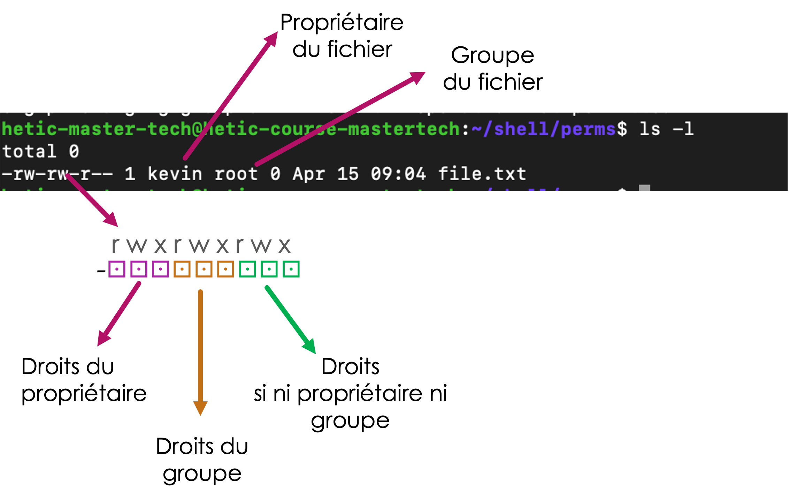

# Préciser les droits

Les droits (_lire, écrire, exécuter_) sont attribués à chaque fichier de notre système.

En effet, en effectuant un `ls -l` pour un fichier, on vois les droits, le nom du propriétaire du fichier, et le nom du groupe à qui appartient le fichier :

<figure><figcaption></figcaption></figure>

La première partie de la ligne exprime un certain nombre de caracteristiques de notre fichier :

| Bit | Qui                                 | Quoi                                                       | Explication                                              |
| --- | ----------------------------------- | ---------------------------------------------------------- | -------------------------------------------------------- |
| 0   |                                     | Le type du fichier : `-` pour fichier, `d` pour répertoire |                                                          |
| 1   | Propriétaire du fichier             | Lecture                                                    | `-` pour pas lisible, `r` pour lisible (_r_ead)          |
| 2   | Propriétaire du fichier             | Ecriture                                                   | `-` pour pas modifiable, `w` pour modifiable (_w_rite)   |
| 3   | Propriétaire du fichier             | Exécution                                                  | `-` pour pas exécutable, `x` pour exécutable (e_x_ecute) |
| 4   | Un membre du même groupe du fichier | Lecture                                                    | `-` pour pas lisible, `r` pour lisible (_r_ead)          |
| 5   | Un membre du même groupe du fichier | Ecriture                                                   | `-` pour pas modifiable, `w` pour modifiable (_w_rite)   |
| 6   | Un membre du même groupe du fichier | Exécution                                                  | `-` pour pas exécutable, `x` pour exécutable (e_x_ecute) |
| 7   | Tout le monde                       | Lecture                                                    | `-` pour pas lisible, `r` pour lisible (_r_ead)          |
| 8   | Tout le monde                       | Ecriture                                                   | `-` pour pas modifiable, `w` pour modifiable (_w_rite)   |
| 9   | Tout le monde                       | Exécution                                                  | `-` pour pas exécutable, `x` pour exécutable (e_x_ecute) |

Dans l'exemple :

* l'utilisateur `kevin` est le propriétaire du fichier
  * l'utilisateur `kevin` peut lire et modifier le fichier, mais il ne peut pas l'exécuter
* le fichier appartient au groupe `root`
  * un autre utilisateur dans le même group `root` peur lire et exécuter le fichier.
* Pour un utilisateur lambda, disons `hetic` :
  * `hetic` n'est pas l'utilisateur `kevin`, donc on ignore les bits 1,2,3
  * `hetic` n'est pas dans le groupe `root`, donc on ignore les bits 4,5,6
  * `hetic` peut donc seulement lire le fichier, mais il ne peut pas le modifier

## C'est malin !

Il y a plus d’utilisateurs que vraie personnes dans une installation Unix. Ils n’ont pas tous des dossiers home, par exemple. On crée des utilisateurs et groupes pour des processus qui tournent sur la machine. L’idée est de finement contrôler les processus globaux, leur donnant accès seulement aux fichiers dont ils ont besoin, et pas plus.

> :bulb: C'est pourquoi les virus ne fonctionnent pas super bien sur Unix, ils n'ont souvent pas les droits suffisants pour vraiment faire du mal !

Par exemple, Apache (le serveur web) :

* Apache crée un utilisateur et groupe : `www-data`
* Apache tourne en tant que cette utilisateur
* Un fichier qui doit être servi par Apache doit être lisible par Apache :
  * Il faut un `r` dans le bit du propriétaire du fichier, si le propriétaire est `www-data`
  * Ou, il faut un `r` dans le bit du groupe du fichier, si le fichier est du groupe `www-data`
  * Ou, il faut un `r` dans le bit pour tous les utilisateurs
* Ca veut dire que n’importe quel fichier qui n’est pas lisible selon les conditions dessus ne sera pas divulgué par erreur via Apache. Attention, l'inverse est vrai aussi !
* C’est la raison pour laquelle on ne tourne pas des processus comme Apache, nginx etc en tant que `root`. On risque de divulger n'importe quel fichier de configuration a grand public !

Autres exemples: `docker`, `mail`, `ssh`, etc.

## Comment changer le propriétaire et le groupe d'un fichier ?

Par défaut, le créateur d'un fichier sera son propriétaire. La plupart du temps chaque utilisateur dispose d'un group à lui aussi. Dans l'exemple suivant, on voit que le nouveau fichier `test` a `hetic` comme utilisateur et groupe.

```bash
hetic@eabaf4e7983c:~$ touch test
hetic@eabaf4e7983c:~$ ls -l test
-rw-r--r-- 1 hetic hetic 0 déc.  22 19:29 test
```

On peut, en revanche, modifier l'utilisateur et group avec la commande `chown` :

```bash
chown [propriétaire]:[groupe] [fichier à modifier]
```

Par exemple, on change le propriétaire à `root` et le groupe à `myparty`:

```
# Créer un groupe pour cet exemple 
hetic@eabaf4e7983c:~$ sudo groupadd myparty

hetic@eabaf4e7983c:~$ chown root:myparty ./test
hetic@eabaf4e7983c:~$ ls -l test
-rw-r--r-- 1 root myparty 0 déc.  22 19:29 test
```

> Attention :
>
> * un utilisateur normale ne peut pas changer le propriétaire d’un fichier, même s’il est propriétaire !
> * Il peut affecter le fichier à un group, seulement si l’utilisateur fait déjà parti du group !

On peut aussi changer le propriétaire et groupes de tout un sous-hierarchie de fichiers et répertoires :

```bash
chown -R [owner]:[group] [répertoire]
```

## Comment accorder/retirer des droits sur un fichier ?

On modifie les bits d'un fichier avec la commande `chmod`.

Chaque triplet se compose de 3 bits (r, w, x) : Si tout est activé sur 3 bits, on a une valeur de 7, parce que c'est la somme des 3 bits, 111 :

$$1*2^0 + 1*2^1 + 1*2^2 = 7$$

Autres exemples:

* `-wx` = `011` =&#x20;

&#x20;$$1*2^0 + 1*2^1 + 0*2^2 = 3$$

* `r-x` = `101` =&#x20;

$$1*2^0 + 0*2^1 + 1*2^2 = 5$$

`chmod` prend donc 3 entiers entre 0 et 7 :

* le premier entier pour préciser les droits du propriétaire
* le deuxième entier pour préciser les droits du groupe
* le troisième entier pour préciser les droits pour tout le monde

Par exemple :

```bash
chmod 754 test.txt
```

* Accorde `rwx` au propriétaire
* Accorde `r-x` au groupe
* Accorde `r--` au publique

Il y a une autre façon de modifier un bit seul avec `chmod` :

```bash
chmod [u|g|o|a][+|-][r|w|x] [fichier]
```

Ou :

* u = propriétaire
* g = groupe
* o = autres
* a = tout (défaut)

Exemples:

```bash
# Autoriser l’exécution sur le fichier par le propriétaire
chmod u+x script.sh

# Enlever le droit d’exécution de tout les utilisateurs
chmod -x script.sh

# Autoriser le groupe à écrire
chmod g+w file.txt
```

> :warning: Avertissement : La plupart de ces permissions ne seront par forcément en rigeur dans vos Containers Docker sous VSCode. En effet, les containers agissent sur le disque sur de l'ordinateur _hôte._ Donc meme si vous modifiez les permissions, propriétaires, groupes des fichiers dans le terminal VSCode, les permissions ne seront pas forcément enforcés.&#x20;
>
> Je vous encourage de tester sur une vrai installation Linux, ou bien dans une machine virtuelle.
