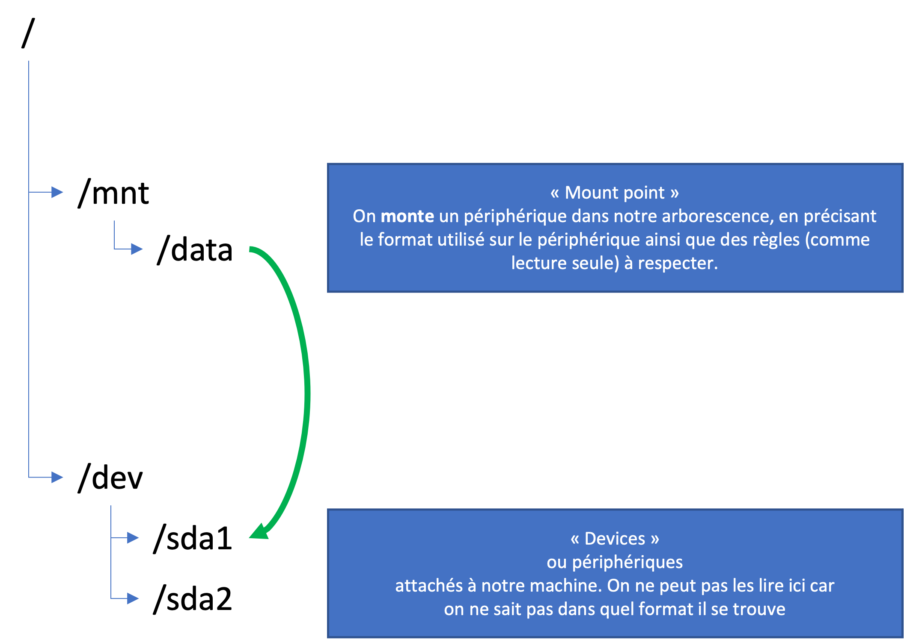

# Disques / partitions

Nous avons déjà dit que dans UNIX tous les fichiers et répertoires existent dans une seule arborescence.

Comment on gère donc une multitude de périphériques, comme de disques, des clés USB ?

On _monte_ un périphérique dans l'arborescence où on veut :

<figure><figcaption></figcaption></figure>

> :exclamation: Attention, les consignes suivantes ne fonctionneront que sur une machine virtuelle, ou une vraie machine à laquelle vous êtes connectée.

## Devices

Un périphérique, ou _device_ est listé sous le répertoire `/dev`. En faite, tout les fichiers qui se trouvent sous `/dev` sont des _interfaces_ vers les pilotes (ou _driver_) des périphériques correspondants.

Pour lister les périphériques, on utilise la commande `df` :

```bash
kevin%nguni.fr@unix-shell-students:~$ df
Sys. de fichiers blocs de 1K Utilisé Disponible Uti% Monté sur
tmpfs                 767248    1016     766232   1% /run
/dev/vda1           75524576 2037248   73470944   3% /
tmpfs                3836232       0    3836232   0% /dev/shm
tmpfs                   5120       0       5120   0% /run/lock
/dev/vda15            106858    5329     101529   5% /boot/efi
tmpfs                 767244       4     767240   1% /run/user/0
tmpfs                 767244       4     767240   1% /run/user/1001
tmpfs                 767244       4     767240   1% /run/user/1002
```

Sur mon serveur, il y a 2 périphériques dans `/dev`. On peut aussi voir :

* Le point de montage dans l'arborescence
* Combien de place reste dans chaque partition/disque.

On ne peut pas naviguer à un périphérique `/dev` avec `cd`, ni lister leurs contenus avec `ls`. Essayez !

En revanche, on peut naviguer vers son point de montage. Dans l'exemple dessus on peut faire `cd /`, mais on ne peut pas faire `cd /dev/vda1`.

## Disques vs partitions

Un disque est un périphérique comme un disque dur ou une clé USB. Sur un disque, on peut créer une ou plusieurs _partitions_, qui sont des espaces indépendantes.

Comment voir les disques et partitions ? Cela change en fonction de votre parfum d'Unix. Sur Ubuntu, on utilise la commande `lsblk` (_l_i_s_t _bl_o_c_k devices) :

```bash
kevin%nguni.fr@unix-shell-students:~$ lsblk
NAME    MAJ:MIN RM  SIZE RO TYPE MOUNTPOINTS
loop0     7:0    0  103M  1 loop /snap/lxd/23541
loop1     7:1    0 63,2M  1 loop /snap/core20/1695
loop2     7:2    0 49,6M  1 loop /snap/snapd/17576
vda     252:0    0 74,5G  0 disk 
├─vda1  252:1    0 74,4G  0 part /
├─vda14 252:14   0    4M  0 part 
└─vda15 252:15   0  106M  0 part /boot/efi
```

Ici, on voit que le disque `vda` contient 3 partitions.

Une partition ou un disque n'est pas obligatoirement monté dans la hiérarchie. `lsblk` nous donne de l'information des périphériques connectés seulement. Il faudrait la monter avant de l'utiliser, et de les voir avec `df`.

## Formater un disque ou partition

Encore une fois, formater un disque ou une partition dépende du parfum Unix que vous utilisez. Dans Ubuntu, on utilise `mkfs` (_m_a_k_e _f_ile _s_ystem).

Par exemple :

```bash
# Formater le périphérique à /dev/sda avec le format "ext4" 
mkfs.ext4 /dev/sda
```

## Monter un périphérique

Si vous branchez une clé USB ou disque dur interne (ou, si vous êtes chez un hébergeur cloud, et vous aimeriez attacher une volume externe), on commence par d'abord lister les périphériques (avec `lsblk`), puis on le monte à l'endroit où on veut :

```bash
mount -o defaults [chemin vers l’appareil block] [chemin de montage]
```

Exemple :

```bash
# Monter le périphérique /dev/sda sur le dossier /mnt/data
mount -o defaults /dev/sda /mnt/data
```

## Monter les disques/partitions/volumes au démarrage

Si on redémarre notre machine UNIX après avoir monter un disque, on perdra nos modifications.

Il faudrait sauvegarder notre manipulation dans un fichier spécial, qui est lu au démarrage. Dans notre cas, le fichier se trouve à `/etc/fstab` :

```bash
kevin%nguni.fr@unix-shell-students:~$ cat /etc/fstab 
LABEL=cloudimg-rootfs   /        ext4   discard,errors=remount-ro       0 1
LABEL=UEFI      /boot/efi       vfat    umask=0077      0 1
```

Pour notre exemple, monter le disque `/dev/sda` (format ext4) sur `/mnt/data` automatiquement au démarrage :

```bash
nano /etc/fstab
# Ajoutez la ligne au fichier, puis sauvegardez :
# /dev/sda /mnt/data ext4 defaults 0 0
```

> :warning: Attention, il vous faut des droits suffisants pour modifier ce fichier !

> :book: Consultez `man fstab` pour en savoir plus du format de ce fichier !

Vous pouvez tester votre modification avec umount et mount:

```bash
# Demonter votre volume
umount /mnt/data

# Re-monter le volume, sans préciser /dev/sda : mount va chercher dans fstab automatiquement
mount /mnt/data
```

Si mount fonctionne correctement, vous pouvez redémarrer votre instance avec :&#x20;

```bash
reboot
```
