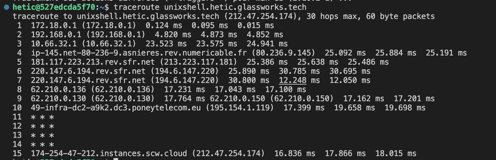

# Connexion réseau

On veut parfois connaître les détails des connexions internet d'une machine UNIX.

## Adresse IP

Pour cela, il nous faudrait le package (sur Ubuntu) `iproute2` :

```bash
sudo apt install iproute2
```

Une fois installé on peut visionner les interfaces réseau de notre machine :

```bash
ip address
```

Exemple :

```bash
hetic@527edcda5f70:~$ ip address
1: lo: <LOOPBACK,UP,LOWER_UP> mtu 65536 qdisc noqueue state UNKNOWN group default qlen 1000
    link/loopback 00:00:00:00:00:00 brd 00:00:00:00:00:00
    inet 127.0.0.1/8 scope host lo
       valid_lft forever preferred_lft forever
2: tunl0@NONE: <NOARP> mtu 1480 qdisc noop state DOWN group default qlen 1000
    link/ipip 0.0.0.0 brd 0.0.0.0
3: ip6tnl0@NONE: <NOARP> mtu 1452 qdisc noop state DOWN group default qlen 1000
    link/tunnel6 :: brd :: permaddr 3a32:b6c2:15e4::
24: eth0@if25: <BROADCAST,MULTICAST,UP,LOWER_UP> mtu 1500 qdisc noqueue state UP group default 
    link/ether 02:42:ac:12:00:02 brd ff:ff:ff:ff:ff:ff link-netnsid 0
    inet 172.18.0.2/16 brd 172.18.255.255 scope global eth0
       valid_lft forever preferred_lft forever
```

## Hosts

Chaque machine UNIX dispose d'une mini DNS (domain name server) qui est la premier chose interrogée quand on tape une adresse web nommé (comme google.com).

Le fichier `/etc/hosts` contient toutes les translations *locales* entre un nom d'hôte est une adresse IP :

Par exemple :

```bash
kevin@Aardvark-II ~ % cat /etc/hosts
##
# Host Database
#
# localhost is used to configure the loopback interface
# when the system is booting.  Do not change this entry.
##
127.0.0.1	localhost
255.255.255.255	broadcasthost
::1             localhost
# Added by Docker Desktop
# To allow the same kube context to work on the host and the container:
127.0.0.1 kubernetes.docker.internal
# End of section
```

Nous pouvons modifier ce fichier pour créer des alias des adresses IP. Utilisez votre éditeur préféré (comme nano) pour le faire.

## Ping et traceroute

On peut tester l'existence (et état) d'une machine distante avec la commande `ping`, qui envoie un petit message au serveur, et qui mesure le temps écoulé avant de recevoir une réponse.

```bash
# Installez le package sur Ubuntu
sudo apt install iputils-ping
```

Ensuite, tester avec google.com, par exemple :

```bash
# Tester l'existence de google
ping google.com

# Tester l'existence d'un autre machine
ping unixshell.hetic.glassworks.tech
```

On peut aussi tracer la route pris par un paquet pour arriver à une destination, avec `traceroute` :

```bash
# Installer traceroute sur Ubuntu
sudo apt install traceroute

# Utiliser traceroute 
traceroute unixshell.hetic.glassworks.tech
```

On voit toutes les machines sur le chemin vers le serveur demandé :

<figure><figcaption></figcaption></figure>


## Dernier mot

Le sujet de configuration de réseau est vast, et pourrait être un cursus à part entier. On n'a pas le temps à tout couvrir pendant ce programme. 

Vous allez en apprendre plus dans d'autres programmes sur votre parcours. Sinon, vous pouvez chercher vous mêmes des ressources, par exemple :
* [Configurer un réseau : Ubuntu documentation](https://guide.ubuntu-fr.org/server/network-configuration.html)