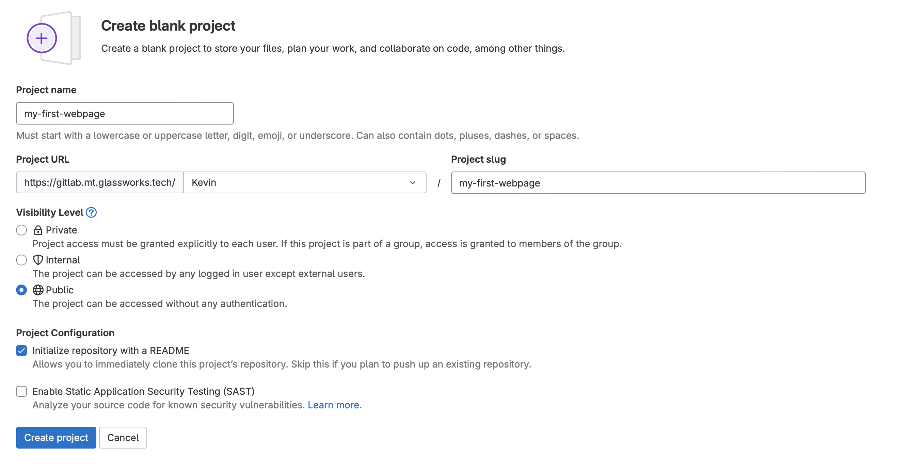
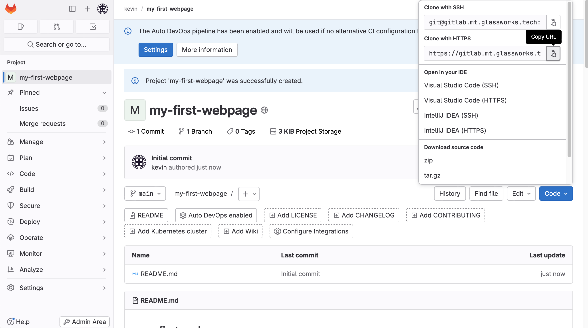

# Commandes

Pour ce cours, nous allons utiliser une instance de Gitlab que je mets à votre disposition :

[https://gitlab.mt.glassworks.tech](https://gitlab.mt.glassworks.tech)

Vous pouvez vous créer un compte avec votre adresse `@hetic.eu`. Merci d'utiliser votre vrai nom pour la création du compte pour que je puisse vous identifier plus facilement.


## Créer votre projet GIT

Connectez-vous au serveur GIT, créez votre premier projet sur le serveur.

Suivez les instructions suivantes :
- Cliquez sur "New Project"
- Cliquez sur "Create blank project"
- Donner un nom à votre project, example "my-first-webpage"
  - Cochez l'option "Visibility level" à "Public"
  - Cochez la case "Initialize the project with a README"




## Installer GIT

Dans le terminal de votre VSCode (avec le DevContainer lancé), installez GIT :

```bash
apt install git
```

## Cloner le projet

Nous allons cloner le projet que nous venons de créer sur le serveur sur notre machine locale.

D'abord, sur GitLab, cliquez sur le bouton bleu "Clone", et copiez le chemin vers votre projet de l'encart marqué "Clone with HTTPS" :



Ensuite, dans votre terminal, tapez :

```bash
# Remplacez [COLLEZ VOTRE URL ICI] par le lien vers votre git copié ci-dessus !
git clone [COLLEZ VOTRE URL ICI]
```

Vous verrez dans votre projet un nouveau dossier `my-first-webpage` avec le `README.md` dedans !

## Etablir mon identité

Il faut d'abord s'identifier auprès de GIT. Ceci se fait une fois seulement :


```bash
# Remplacr par votre adresse email et nom/prénom
git config --global user.email "Vous@exemple.com"
git config --global user.name "Votre Nom"

# Cette commande précise comment stocker nos coordonnées de connexion au serveur
git config --global credential.helper "store --file $HOME/.git-credentials"
# Cette commande précise comment fusionner des versions venants du serveur
git config pull.rebase false
```

## Ajouter une page html

Ajoutez une page HTML à votre projet. Créer un fichier `my-first-webpage/index.html` :

```html
<!doctype html>
<html>
  <head> 
    <title>My first webpage !</title>
    <link href="https://cdn.jsdelivr.net/npm/bootstrap@5.3.2/dist/css/bootstrap.min.css" rel="stylesheet" integrity="sha384-T3c6CoIi6uLrA9TneNEoa7RxnatzjcDSCmG1MXxSR1GAsXEV/Dwwykc2MPK8M2HN" crossorigin="anonymous">
  </head>
  <body>
    <div class="container">
      <div class="col">
        <h1>Bienvenue sur ma première page web !</h1>
      <div>
    </div>
  </body>
  
  <script src="https://cdn.jsdelivr.net/npm/bootstrap@5.3.2/dist/js/bootstrap.bundle.min.js" integrity="sha384-C6RzsynM9kWDrMNeT87bh95OGNyZPhcTNXj1NW7RuBCsyN/o0jlpcV8Qyq46cDfL" crossorigin="anonymous"></script>
  
</html>
```

Sauvegarder le fichier.

Pour créer une sauvegarde locale de ce fichier, dans le terminal  :

```bash
# Naviguez dans le dossier de notre projet
cd my-first-webpage

# Ajouter tous les fichiers ajoutés ou modifiés
git add .

# Créer une sauvegarde, en mettant une etiquette
git commit -m "Ajout de la page index.html"
```

Nous avons maintenant une version !

## Envoyer cette version au serveur

### Récupérer un jeton d'accès

Maintenant, on va vouloir se connecter à notre projet GIT sur le serveur.

Sur Gitlab, naviguez dans "Settings -> Access Tokens". Ajoutez un nouveau token avec les droits suivante :

- Role: "Maintainer"
- `read_repository`
- `write_repository`

Copiez le token généré. Attention, il n'est affiché qu'une seule fois !

### Envoyer la version

Pour envoyer la version au serveur, il suffit de faire :

```bash
git push
```

Lorsqu'il demande le **nom d'utilisateur**, mettez le nom de votre compte GitLab.

Lorsqu'il demande le **mot de passe**, mettez le jeton d'accès que vous avez crée dans l'étape précédent.

Retournez sur Gitlab et recharger la page. Vous verrez la modification arriver sur le serveur !

## Apporter une modification

Modifez la page `index.html` en local. Ajoutez votre nom et prénom, par exemple: 

```html
    ...
    <h1>Bienvenue sur ma première page web !</h1>
    <p>Je m'appelle Kevin Glass</p>
    ...
```

Pour crée une sauvegarde local, on fait :


```bash
git add .
git commit -m "Added my name"
```

On ne sait pas encore si quelqu'un d'autre a apporté une modification depuis notre dernière suavegarde. On veut d'abord récuperer ses modifications à lui pour vérifier.

```bash
git pull
```

S'il n'y a pas de conflit, on peut procéder avec notre envoi vers le serveur.

```bash
git push
```

## Gestion de conflits

Nous allons artifiellement créer un conflit - la situation où deux personnes aurait touché au même fichier.

### Una autre personne change le fichier

Sur Gitlab, cliquer sur le fichier `index.html`, et cliquez sur le bouton "Edit" &rarr; "Edit this file only".

Dans l'editeur, changez le nom et prénom à "Willy Wonka".

Cliquez sur le bouton "Commit Changes".

### Vous changez en parallèle le fichier

En local, changer le nom aussi, mettez `Harry Potter`.

Essayons de sauvegarder en envoyer notre modification.

```bash
git add .
git commit -m "Change name to harry potter"
```

Essayons d'envoyer notre version local.

```bash
git push

###
! [rejected]        main -> main (fetch first)
```

Oups ! Notre sauvegarde a été rejeté à cause d'un conflit ! Nous allons devoir le corrier !

Il faut d'abord récupéré la version du serveur qui est en conflit avec la notre :

```bash
git pull

# Fusion automatique de index.html
# CONFLIT (contenu) : Conflit de fusion dans index.html
# La fusion automatique a échoué ; réglez les conflits et validez le résultat.
```

Nous voyons qu'il y a eu un conflit dans `index.html`. Ouvrons le :

```html
<!doctype html>
<html>
  <head> 
    <title>My first webpage !</title>
    <link href="https://cdn.jsdelivr.net/npm/bootstrap@5.3.2/dist/css/bootstrap.min.css" rel="stylesheet" integrity="sha384-T3c6CoIi6uLrA9TneNEoa7RxnatzjcDSCmG1MXxSR1GAsXEV/Dwwykc2MPK8M2HN" crossorigin="anonymous">
  </head>
  <body>
    <div class="container">
      <div class="col">
        <h1>Bienvenue sur ma première page web !</h1>       
<<<<<<< HEAD
        <p>Je m'appelle Harry Potter</p> 
=======
        <p>Je m'appelle Willy Wonka</p> 
>>>>>>> d54e467bcb2ee89b5f84206842359ab6d960d2c5
      <div>
    </div>
  </body>
  
  <script src="https://cdn.jsdelivr.net/npm/bootstrap@5.3.2/dist/js/bootstrap.bundle.min.js" integrity="sha384-C6RzsynM9kWDrMNeT87bh95OGNyZPhcTNXj1NW7RuBCsyN/o0jlpcV8Qyq46cDfL" crossorigin="anonymous"></script>
  
</html>
```

Notez que les lignes en conflits sont marquées :

- la zone marquée `HEAD` : le modification sur ma machine locale
- la deuxième zone : la modification venant du serveur

Il suffit de choisir la version souhaitée, en corrigeant le fichier (et en enlevant les lignes `<<<` et `===` et `>>>`) :

```html
<!doctype html>
<html>
  <head> 
    <title>My first webpage !</title>
    <link href="https://cdn.jsdelivr.net/npm/bootstrap@5.3.2/dist/css/bootstrap.min.css" rel="stylesheet" integrity="sha384-T3c6CoIi6uLrA9TneNEoa7RxnatzjcDSCmG1MXxSR1GAsXEV/Dwwykc2MPK8M2HN" crossorigin="anonymous">
  </head>
  <body>
    <div class="container">
      <div class="col">
        <h1>Bienvenue sur ma première page web !</h1>       
        <p>Je m'appelle Harry Potter</p> 
      <div>
    </div>
  </body>
  
  <script src="https://cdn.jsdelivr.net/npm/bootstrap@5.3.2/dist/js/bootstrap.bundle.min.js" integrity="sha384-C6RzsynM9kWDrMNeT87bh95OGNyZPhcTNXj1NW7RuBCsyN/o0jlpcV8Qyq46cDfL" crossorigin="anonymous"></script>
  
</html>
```

J'aurais fait un changement local, donc je doit crée une nouvelle version :

```bash
git add .
git commit -m "Correction de conflit"
```

Ensuite j'envoie ma version au serveur :

```bash
git push
```

