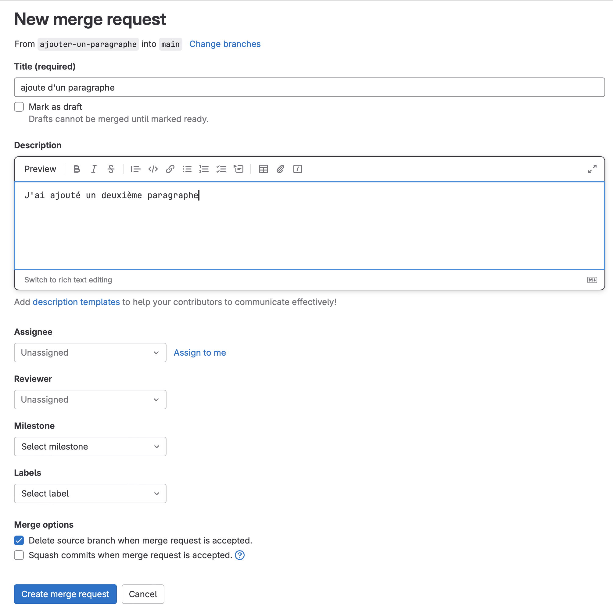
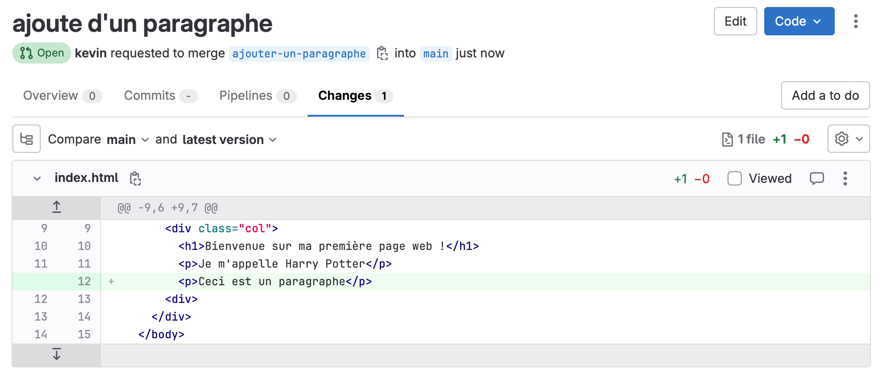

# Branches

Pour réduire le risque de conflits, mais aussi pour retracer correctement l'évolution de caractéristiques spécifiques, nous créons des branches.

En règle générale, chaque projet Git dispose d'une branche principale, qui représente une version de travail validée de notre code. Elle est souvent appelée `master` ou `main`.

Nous souhaitons maintenant apporter une modification à notre code. 

D'abord, il faut être sur d'avoir la toute dernière version du code en local :

```bash
git pull

# Régler les conflits s'il y en a
```


## Création d'une branche

```bash
git checkout -b ajouter-un-paragraphe
```

Nous sommes actuellement sur la branche intitulée `ajouter-un-paragraphe`.  

Ajouter un paragraphe à votre page web :

```html
        ...
        <p>Je m'appelle Harry Potter</p> 
        <p>Ceci est un paragraphe</p> 
        ...
```

Créer une sauvegarde :


```bash
git add .
git commit -m "ajoute d'un paragraphe"
```

## Changer de branche

Je peux à tout moment, revenir sur la branche `main` :

```bash
git checkout main
```

Observer votre fichier `index.html`. Votre paragraphe a disparu ! Pourquoi ? C'est une version différente sur une branche différente !

Pour revenir à ma branche de travail :

```bash
git checkout ajouter-un-paragraphe
```

Mon paragraphe est revenu !

## Des branches non propres

Apportez une modification à votre fichier `index.html`.

Essayez maintenant de changer vers la branche main :

```bash
git checkout main

# error: Vos modifications locales aux fichiers suivants seraient écrasées par l'extraction :
#        index.html
# Veuillez valider ou remiser vos modifications avant de basculer de branche.
# Abandon
```

Une erreur est survenu car votre modification locale créera un conflit avec la branche `main`. Nous n'avons pas encore crée une sauvegarde de cette modification, et donc git ne sais pas comment procéder, au risque de perdre la modification.

Il y a deux options :

- créer une sauvegarde avec `git add .` et `git commit -m "un message"`
- abandonner les modifications locales

Nous savons déjà créer une sauvegarde.

Il se trouve que ma modification locale était une erreur, je veut juste remettre mon code dans l'état de la dernière sauvegarde:

```bash
git stash
```

Regardez maintenant `index.html`. Votre modification locale a été enlevé.

Vous pouvez maintenant changer de branche sans souci.

## Fusionner une branche

Entretemps, la branche `main` aura évolué suite aux modifications d'un autre developpeur. On peut intégrer ses modifications dans notre branche avec :

```bash
git merge main
```

Le derner mot est le nom de l'autre branche à intégrer dans la branche actuelle.

## Envoyer une branche

On peut aussi envoyer une branche sur le serveur :

```bash
git push --set-upstream origin ajouter-un-paragraphe
```

## Merge-requests

Souvent après avoir envoyé une branche au serveur, et après plusieurs itérations de notre code, nous serions prêts à intégrer notre modification dans la branche principale.

A ce moment là, nous allons retourner sur GitLab, et chercher notre branche dans **Code &rarr; Branches**.

Cliquez sur le bouton "New" afin de créer une "Merge request", qui est une demande officielle de fusionner votre branche dans la branche principale du projet :



Remplissez quelques détails sur votre travail. 

Un tech-lead pourrait maintenant regarder votre travail, et surtout regarder les modifications que vous avez apporté.



S'il accepte, il clique sur le bouton "Merge". Gitlab s'occupe automatiquement de fussionner votre branche avec la branche principale. Votre travail est désormais intégré dans le code officiel !

En local, il va falloir récupérer la nouvelle version de la branche `main` :


```bash
git checkout main

git pull
```

