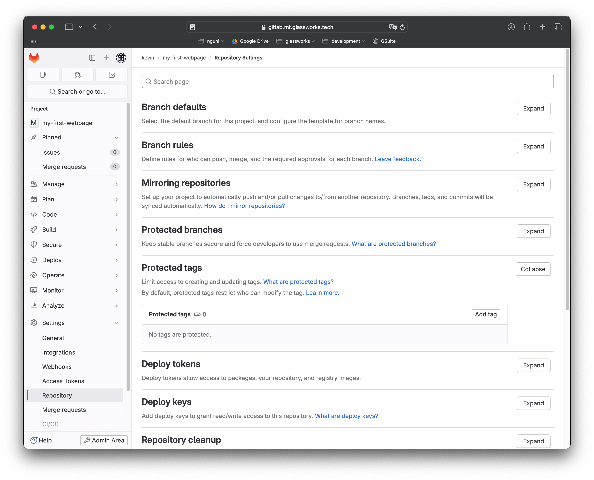
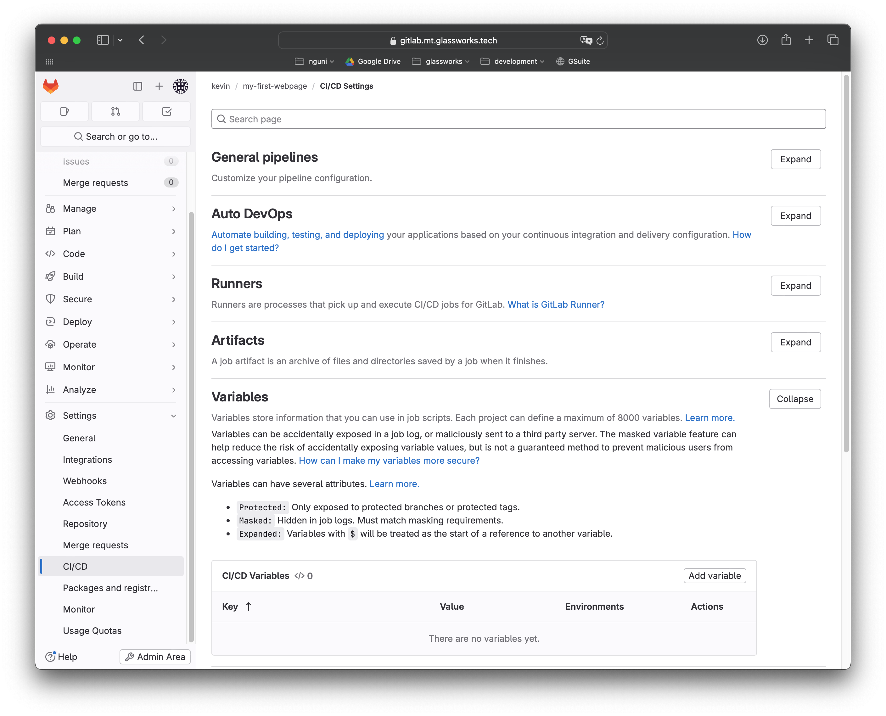
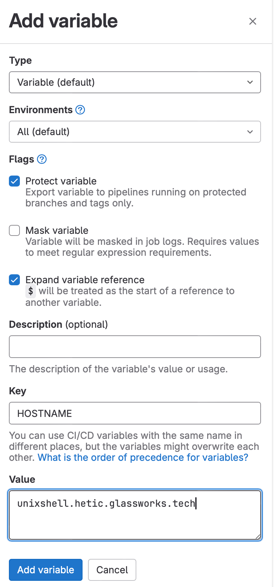
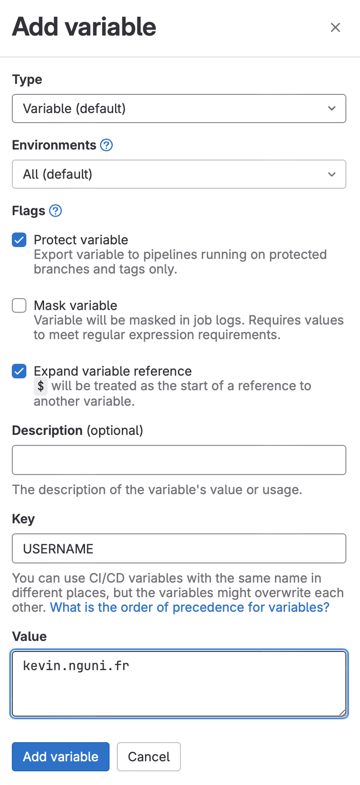
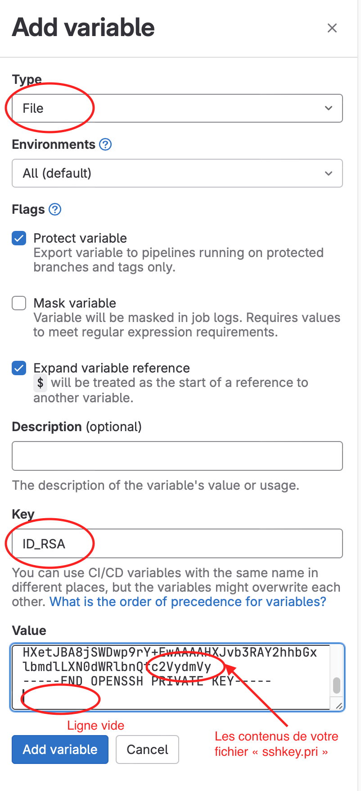

# Déploiement automatique

Nous souhaitons maintenant déployer notre site web sur le serveur de production directement à partir d'un serveur Git, chaque fois que nous créons un **Tag**, ou **etiquette**.

Une étiquette est une manière de signaler qu'une version dans Git est prêt pour production. Souvent on lui donne une étiquette de forme numérique, par exemple "3.1.1".

## Configuration des Tags

D'abord, nous allons **protéger** nos tags dans Gitlab, en précisant que seulement des tags d'un certain format puissent être déployé en production.

Naviguez dans **Settings &rarr; Repository &rarr; Protected Tags**. 



Tapez `*.*.*` dans la barre de recherche, puis cliquer sur "Create wildcard tag". Sélectionner le role `Maintainers` (seulement les utilisateurs privilégiés auront le droit à déployer); puis cliquer sur "Protect".


## Créer un Tag 

Navigez dans **Code &rarr; Tags**. Ici, on peut ajouter un Tag en lui donnant un nomme de la forme X.X.X par exemple (`1.0.0`). 

Git va désormais reconnaitre l'état actuel de notre code et l'associer à cette version. On pourrait revenir dessus si jamais il y a une erreur ponctuelle à résoudre.

## Déclencher un dépoloiement grâce à un Tag

Idéalement, lorsque nous créons un Tag, Gitlab déploie automatiquement notre site web pour nous. C'est possible !

Nous devons écrire un script qui se connectera à notre serveur de production (avec `ssh`) et copiera les fichiers de notre site web dans le bon répertoire (avec `scp`).


### Créer des variables secretes

Nous savons que pour créer une connexion SSH, il faudrait 3 informations :

- le nom d'utilisateur
- l'adresse IP ou le nom d'hôte de la machine de production
- la clé privé SSH

Nous allons créer des variables dans Gitlab pour stocker ses valeurs.

Naviguez dans **Settings &rarr; CI/CD &rarr; Variables**.



Ajoutez 3 variables :

Pour le nom d'hote :


Pour le nom d'utilisateur, remplacez "kevin.nguni.fr" par votre utilisateur que vous utilisez pour se connecter au serveur.



Pour la clé ssh :



### Rediger une script automatisé

Naviguez dans **Build &rarr; Pipeline Editor**, et créer un nouveau Pipeline.

Collez le code suivant :

```yaml
stages:
  - deploy

deploy-job:
  stage: deploy
  tags:
    - general
  only:
    - tags
  image: alpine:latest
  script:    
    - chmod og= $ID_RSA
    - apk update && apk add openssh-client
    - scp -i $ID_RSA -o StrictHostKeyChecking=no index.html $USERNAME@$HOSTNAME:/var/www/html/$USERNAME/
```

Testez en créant un Tag dans **Code &rarr;Tags**. Ensuite naviguez dans **Build &rarr; Pipelines** pour voir la tâche s'éxecuter toute seule.

Si tout se passe correctement, Gitlab va connecter à votre compte et déposer votre fichier dans le bon dossier automatiquement !

Vous pouvez par la suite tester ! Ouvrez un navigateur web, et naviguer vers le lien suivant, en remplaçant `VOTRE_NOM_UTILISATEUR` par votre nom d'utilisateur pour accéder au serveur :

```
https://unixshell.hetic.glassworks.tech/VOTRE_NOM_UTILISATEUR/index.html
```

Vous devriez voir votre page !

## Testons la pipeline

Retournons à notre terminal.

D'abord, récupérez la version la plus à jour de notre projet.

```bash
git pull
```

Ensuite, apporter une modification quelquonque à la page `index.html`.

Créer une sauvegarde locale, et envoyez la au serveur.

```bash
git add .
git commit -m "Ajoute d'un autre paragraphe"
git push
```

Retournez à Gitlab, et créez un Tag, avec un numéro de version plus elevé, par exemple, `1.0.1`.

Attendez que votre tâche automatisé soit terminée, et rechargez votre page sur `https://unixshell.hetic.glassworks.tech`. Votre modification a été dépolyée !

