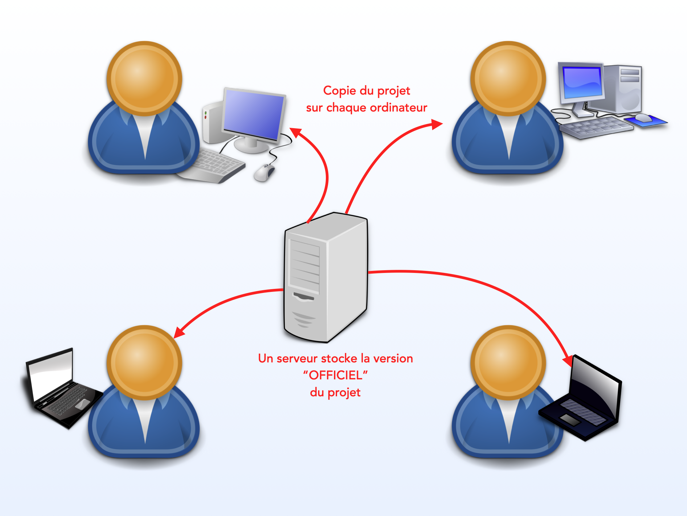
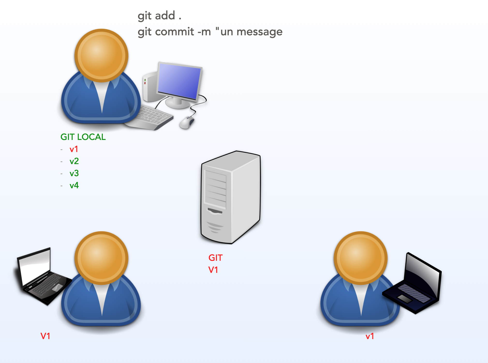
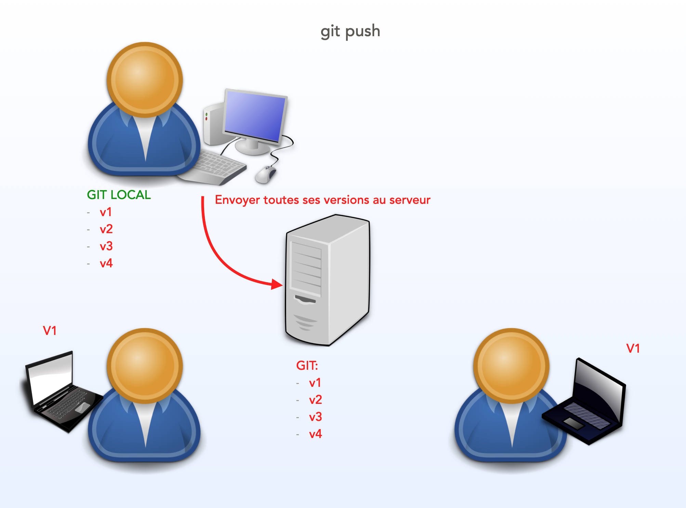
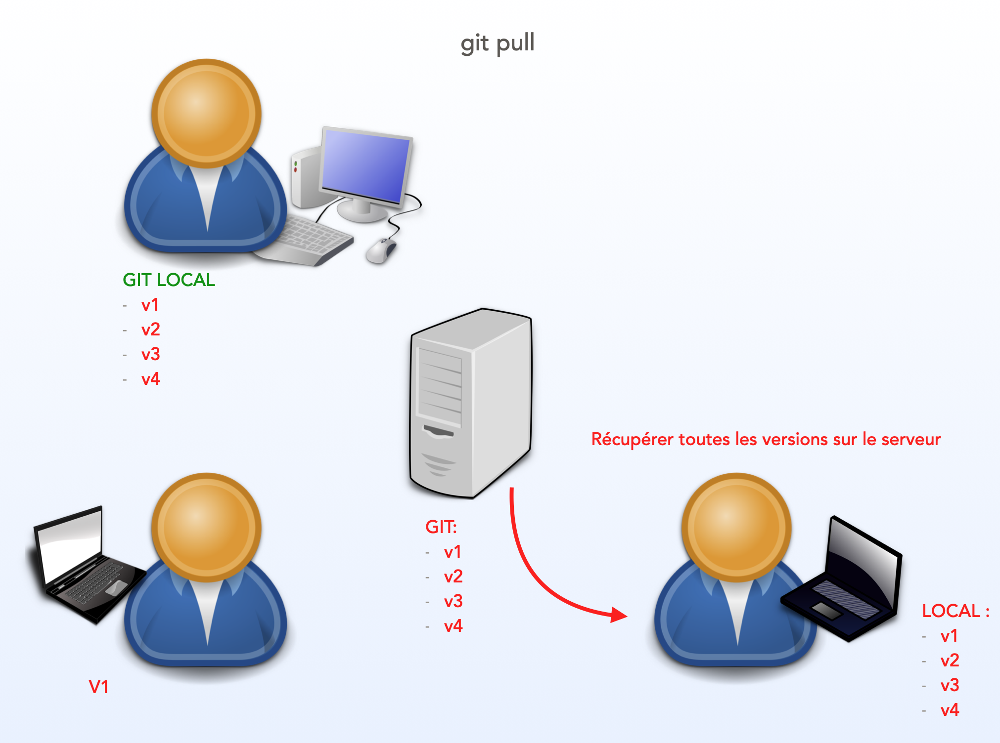
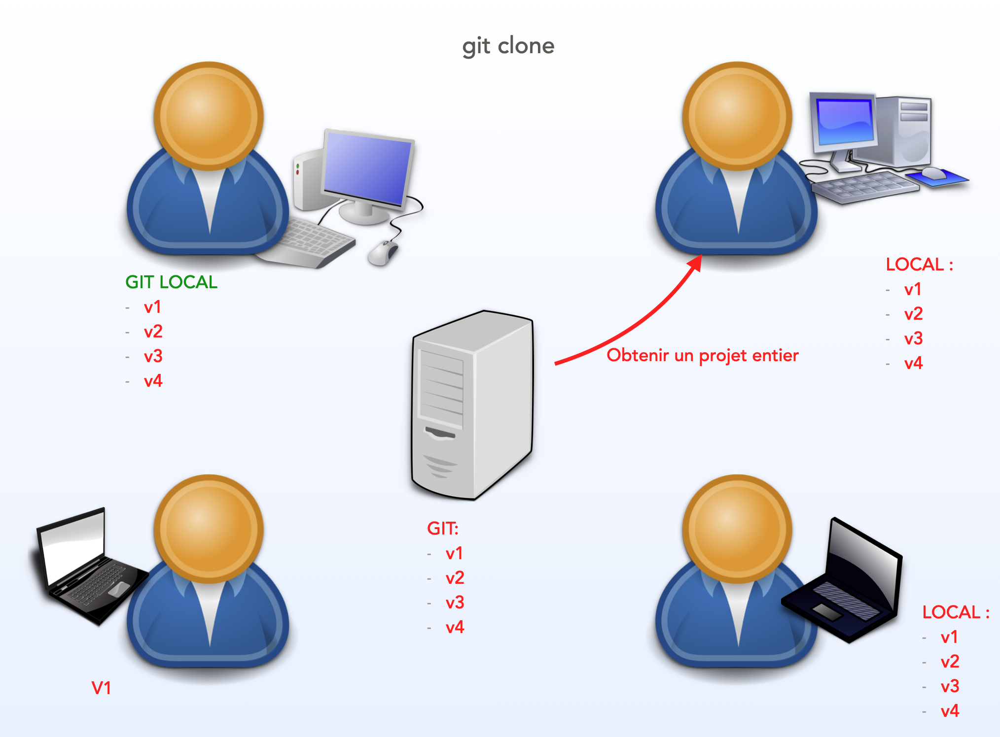

# GIT

GIT est un système de gestion du code source au sein d'équipes collaboratives.

Il offre de multiples fonctions :

- Création et suivi des versions de notre projet
- La possibilité de développer en parallèle via des "branches".
- Fusionner les branches et les modifications en une seule version officielle
- Automatisation des tests et de l'exécution des tâches
- ...

## Collaboration

L'idée est de maintenir une version centralisée de notre projet - une source unique de vérité.

Cependant, chaque membre de l'équipe peut vouloir continuer à développer sur sa propre machine.

Git vous permet de travailler de manière indépendante et de sauvegarder un certain nombre de versions locales sur votre propre machine. Pour l'instant, ces versions n'existent que sur votre machine.

À un moment donné, vous souhaiterez peut-être envoyer vos versions locales au serveur centralisé. C'est généralement le cas lorsque vous avez terminé votre travail et que vous êtes prêt à le partager avec votre équipe.

Le serveur dispose maintenant de toutes vos versions.

Notez que les deux autres membres n'ont que la première version. Ils peuvent eux aussi continuer à travailler sur leurs propres versions sans être interrompus par vos mises à jour.

Toutefois, à un moment donné, ils souhaiteront peut-être recevoir vos mises à jour. Ils peuvent demander une mise à jour au serveur central.

Bien entendu, cela peut entraîner des conflits. Que se passe-t-il si l'une de leurs versions entre en conflit avec le travail que vous avez effectué localement ? Git fournit un moyen de résoudre ces conflits, notamment en vous permettant de comparer et de choisir la bonne version.

Enfin, si un nouveau membre arrive dans l'équipe, il peut récupérer tout l'historique du projet.

