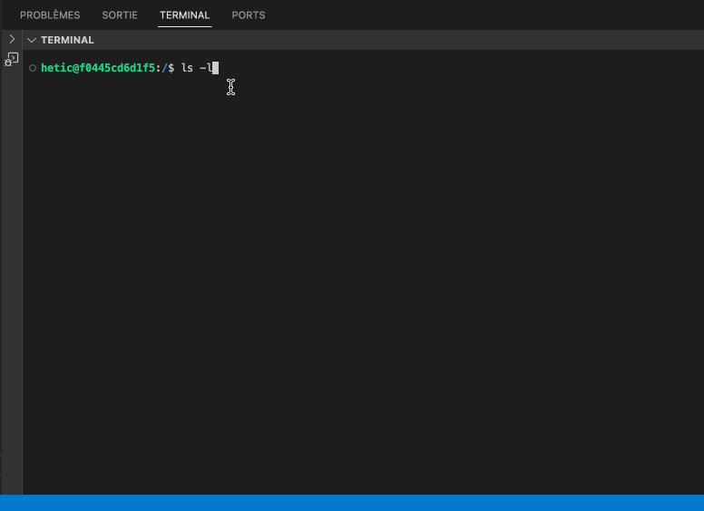

# L'invite de commandes

L’invite de commandes ou **SHELL** est une interface permettant de taper des instructions sur le clavier.&#x20;

<figure><figcaption></figcaption></figure>

Quand on appuie sur « Entrée », la ligne est _**interprétée**_ et _**exécutée**_&#x20;

Plusieurs avantages :&#x20;

* Une interface peu lourde : nous n’avons pas a s’occuper d’un rendu compliqué.&#x20;
* Pas besoin d’un système d’affichage, carte graphique, etc&#x20;
* Permet une connexion et du contrôle à distance : on peut juste envoyer nos gestes clavier à un autre ordinateur (via une connexion SSH par exemple), et le texte sera interprété coté destinataire.&#x20;
* Permet de rédiger au préalable une liste de commandes dans un script, qui pourrait être interprété plus tard, ou régulièrement

Le dernier point est un grand avantage. Imaginons le scénario suivant : vous avez un dossier de photos de vacances avec 500 photos à 8Mo chacun en format RAW. Vous voulez réduire en taille, les renommer, puis sauvegarder en format `.jpg`.

* Soit vous payez un logiciel pour le faire :cold\_sweat:
* Soit vous passer manuellement, image par image, à effectuer les différences manipulation :dizzy\_face:
* Soit on écrit un script qui fera la tâche dans une invite de commandes. Le pseudo-code suivant démontre l'idée :


```
for each file F in current folder
  resize F width=1024 height=768
  convert F to jpg
```


Ensuite, on n'aura juste à executer ce script :&#x20;


```
run convert_my_photos.script
```


:thumbsup:Facile et rapide... en encore mieux, gratuit :thumbsup:

