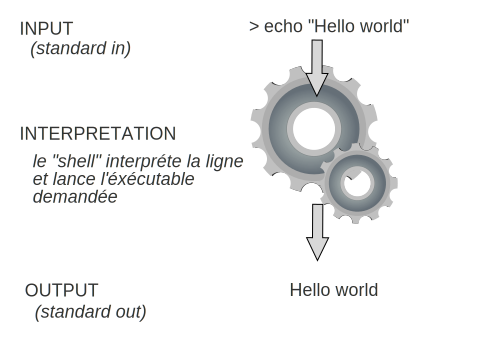

# L'interprète

On peut commencer à taper des instructions, et voir les résultats.

Commencez par le suivant :

```bash
echo "Hello world!"
```

Qu'est-ce qui se passe ?

Ensuite, essayez :

```bash
cd /
ls -l
```

Est-ce que vous comprenez les résultats ?

## Interprétation des instructions

<figure><figcaption></figcaption></figure>

## Les interprètes

Quand on lance une invite de commandes, un interprète est lancé. C'est un logiciel qui va nous permettre de rédiger des instructions en tant que texte.

En toute simplicité, un interprète reçoit un flux de texte. Dès qu'on envoie le caractère "Entrée", l'interprète sais qu'il faut lancer son opération sur tous les caractères qui le précèdent.

Il y a plusieurs interprètes en existence :

* **sh** : le « bourne shell », un shell suivant la norme POSIX
* **bash** : le « bourne again shell », un superset de **sh** mais avec de features supplémentaires, par exemple, la complétion des commandes (avec tab),  historique, et  evaluation mathématique
* **zsh** : super set de bash avec plus de features : correction d’orthographe etc

Chaque interprète nous donnes plus ou moins fonctionnalités d'interpretation à nos commandes.

Avec la [configuration de ce cours](../../introduction/010-introduction/installation-party.md), nous sommes dans l'interprète **bash.**

## Un interprète dans un interprète

Quand on ouvre l'application "Terminal", que ce soit dans VSCode, ou bien via l'invite de commandes sur MacOS, Windows ou Linux, la seule chose qui se lance est une fenêtre qui visionne notre interprète.

On pourrait lancer un autre interprète _au sein_ du premier !

```bash
hetic@f0445cd6d1f5:/$ sh
$
```

Notre invite de commandes exécute désormais l'interprète qui s'appelle `sh` qui est un autre interprète que `bash` (avec un set de fonctionnalités plus limité).

On remarque la différence par le **prompt** (ou _réplique_ en français) :

* Dans `bash`, le prompt affiche le nom d'utilisateur connecté suivi par le nom de la machine ou serveur auquel on est connecté, suivi par le dossier dans lequel on se trouve, suivi par `$` :

```bash
hetic@f0445cd6d1f5:/home$
# Donc:
# - hetic = le nom de l'utilisateur
# - f0445cd6d1f5 = le nom de la machine (dans ce cas, un ID unique pour notre machine virtuelle)
# /home = le dossier actuel
```

* Dans `sh`, c'est un interprète plus simple, et on n'a pas toutes ses informations. On ne voit que le prompt ($) :

```shell
$
```

A tout moment, on peut quitter ce dernier interprète en tapant `exit` :

```shell
$ exit
hetic@f0445cd6d1f5:/$
```

Vous verrez que le prompt revient au précédent. On a **fermé** l'interprète `sh` et on est revenu dans l'interprète `bash` d'avant.

> Question : Est-ce que vous constatez d'autres différences entre l'interprète `bash` et `sh` ?
